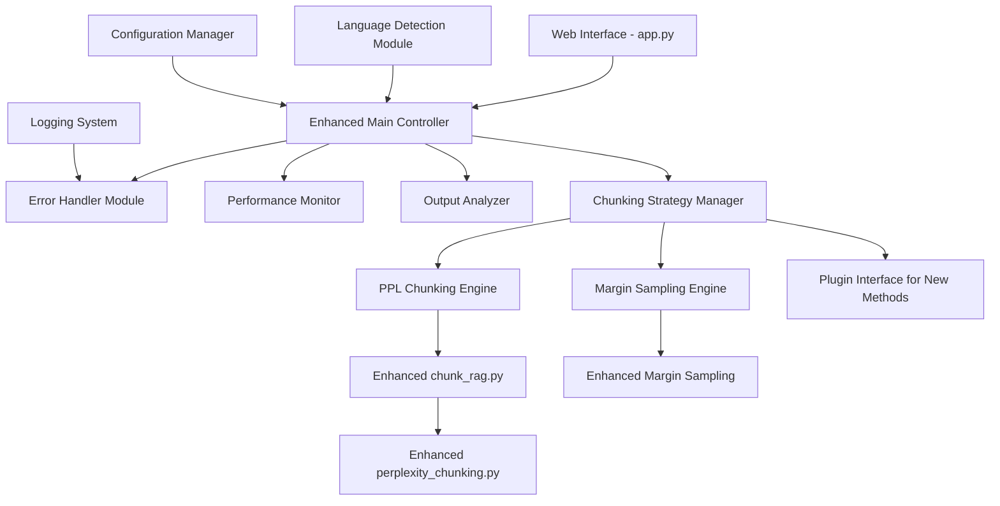

# Design Document

## Overview

The Meta-Chunking Enhancement project will improve the existing Meta-Chunking text segmentation system by adding comprehensive documentation, robust error handling, performance monitoring, detailed output analysis, modular architecture, and enhanced language support. The design maintains backward compatibility while introducing new features that make the system more maintainable, reliable, and user-friendly.

## Architecture

### Current System Architecture
The existing system consists of three main components:
- **app.py**: Gradio web interface and main orchestration logic
- **chunk_rag.py**: PPL chunking algorithm implementations with various optimization strategies
- **perplexity_chunking.py**: Core perplexity calculation engine
- **data/examples.json**: Sample data for testing and demonstration

### Enhanced Architecture
The enhanced system will maintain the existing structure while adding new layers:



## Components and Interfaces

### 1. Enhanced Documentation System
**Purpose**: Provide comprehensive code documentation following consistent standards

**Components**:
- **DocstringEnhancer**: Adds detailed docstrings to all functions and classes
- **InlineCommentManager**: Manages inline comments for complex algorithms
- **ConfigurationDocumenter**: Documents all configuration parameters

**Interface**:
```python
class DocumentationManager:
    def enhance_docstrings(self, module_path: str) -> None
    def add_inline_comments(self, function_name: str, comments: Dict[int, str]) -> None
    def document_parameters(self, param_dict: Dict[str, Any]) -> str
```

### 2. Error Handling and Validation System
**Purpose**: Provide robust error handling with meaningful user feedback

**Components**:
- **InputValidator**: Validates user inputs before processing
- **ModelLoadingHandler**: Manages model loading failures and retries
- **MemoryManager**: Handles memory limitations gracefully
- **NetworkErrorHandler**: Manages network-related issues

**Interface**:
```python
class ErrorHandler:
    def validate_input(self, text: str, language: str, chunk_length: int) -> ValidationResult
    def handle_model_loading_error(self, error: Exception) -> ModelLoadingResult
    def handle_memory_error(self, error: MemoryError) -> MemoryHandlingResult
    def provide_user_feedback(self, error_type: str, details: str) -> str
```

### 3. Performance Monitoring System
**Purpose**: Track and display processing performance metrics

**Components**:
- **ProcessingTimer**: Measures processing times for different operations
- **ProgressTracker**: Shows progress indicators for long-running operations
- **PerformanceComparator**: Compares performance between different chunking methods
- **ResourceMonitor**: Monitors system resource usage

**Interface**:
```python
class PerformanceMonitor:
    def start_timing(self, operation_name: str) -> str
    def end_timing(self, timer_id: str) -> float
    def update_progress(self, current: int, total: int, message: str) -> None
    def compare_methods(self, method1_time: float, method2_time: float) -> ComparisonResult
    def get_resource_usage(self) -> ResourceUsage
```

### 4. Output Analysis System
**Purpose**: Provide detailed analysis of chunking results

**Components**:
- **ChunkAnalyzer**: Analyzes chunk statistics and quality metrics
- **PerplexityReporter**: Reports perplexity scores and decision points
- **ProbabilityAnalyzer**: Analyzes probability differences in margin sampling
- **StatisticsGenerator**: Generates comprehensive statistics about chunking results

**Interface**:
```python
class OutputAnalyzer:
    def analyze_chunks(self, chunks: List[str]) -> ChunkAnalysis
    def report_perplexity_scores(self, scores: List[float], split_points: List[int]) -> PerplexityReport
    def analyze_probabilities(self, prob_differences: List[float]) -> ProbabilityAnalysis
    def generate_statistics(self, chunks: List[str], method: str) -> ChunkingStatistics
```

### 5. Modular Chunking System
**Purpose**: Support plugin-style architecture for adding new chunking methods

**Components**:
- **ChunkingMethodRegistry**: Manages available chunking methods
- **PluginLoader**: Loads and validates new chunking plugins
- **MethodInterface**: Defines standard interface for chunking methods
- **ConfigurationManager**: Manages method-specific configurations

**Interface**:
```python
class ChunkingMethod(ABC):
    @abstractmethod
    def chunk_text(self, text: str, config: Dict[str, Any]) -> List[str]
    
    @abstractmethod
    def get_method_info(self) -> MethodInfo
    
    @abstractmethod
    def validate_config(self, config: Dict[str, Any]) -> bool

class ChunkingRegistry:
    def register_method(self, method: ChunkingMethod) -> None
    def get_method(self, method_name: str) -> ChunkingMethod
    def list_available_methods(self) -> List[str]
```

### 6. Enhanced Language Support System
**Purpose**: Improve language detection and support for various text types

**Components**:
- **LanguageDetector**: Automatically detects text language
- **MixedLanguageHandler**: Handles documents with multiple languages
- **StructuredTextProcessor**: Preserves code blocks and special formatting
- **HierarchyPreserver**: Respects document structure and sections

**Interface**:
```python
class LanguageSupport:
    def detect_language(self, text: str) -> LanguageDetectionResult
    def handle_mixed_language(self, text: str) -> MixedLanguageResult
    def preserve_structure(self, text: str, text_type: str) -> StructuredText
    def apply_language_specific_chunking(self, text: str, language: str) -> List[str]
```

## Data Models

### Enhanced Configuration Model
```python
@dataclass
class ChunkingConfig:
    method: str
    language: str
    chunk_length: int
    ppl_threshold: float
    auto_detect_language: bool = True
    preserve_structure: bool = True
    enable_performance_monitoring: bool = True
    enable_detailed_output: bool = True
    max_memory_usage: int = 8192  # MB
    batch_size: int = 4096
    enable_progress_tracking: bool = True
```

### Performance Metrics Model
```python
@dataclass
class PerformanceMetrics:
    processing_time: float
    memory_usage: float
    tokens_processed: int
    chunks_created: int
    method_used: str
    batch_processing_time: Optional[float] = None
    model_loading_time: Optional[float] = None
```

### Analysis Results Model
```python
@dataclass
class ChunkingAnalysis:
    total_chunks: int
    average_chunk_length: float
    chunk_length_distribution: List[int]
    perplexity_scores: Optional[List[float]] = None
    probability_differences: Optional[List[float]] = None
    split_points: List[int]
    quality_score: float
    processing_metrics: PerformanceMetrics
```

## Error Handling

### Error Categories and Handling Strategies

1. **Input Validation Errors**
   - Empty text input → Clear error message with suggestions
   - Invalid language code → Auto-detection fallback
   - Invalid chunk length → Default value with warning

2. **Model Loading Errors**
   - Network connectivity issues → Retry mechanism with exponential backoff
   - Insufficient memory → Reduce batch size automatically
   - Model file corruption → Clear cache and re-download

3. **Processing Errors**
   - Memory overflow → Implement text chunking for processing
   - GPU out of memory → Fallback to CPU processing
   - Timeout errors → Progress indication and cancellation option

4. **Output Generation Errors**
   - Empty chunks → Fallback to simple sentence splitting
   - Malformed results → Data validation and correction

### Error Recovery Mechanisms
```python
class ErrorRecovery:
    def implement_retry_logic(self, operation: Callable, max_retries: int = 3) -> Any
    def fallback_to_simple_chunking(self, text: str) -> List[str]
    def reduce_memory_usage(self, current_config: ChunkingConfig) -> ChunkingConfig
    def provide_graceful_degradation(self, error_type: str) -> FallbackStrategy
```

## Testing Strategy

### Unit Testing
- Test individual functions with various input scenarios
- Mock external dependencies (model loading, GPU operations)
- Test error handling paths and edge cases
- Validate output formats and data structures

### Integration Testing
- Test complete chunking workflows end-to-end
- Test different language combinations
- Test performance under various load conditions
- Test plugin system with custom chunking methods

### Performance Testing
- Benchmark processing times for different text sizes
- Memory usage profiling under various configurations
- Stress testing with concurrent requests
- Comparison testing between different chunking methods

### User Acceptance Testing
- Test web interface usability improvements
- Validate error messages are clear and actionable
- Test documentation completeness and accuracy
- Verify performance monitoring displays are helpful

## Implementation Phases

### Phase 1: Documentation and Error Handling
- Enhance all existing code with comprehensive documentation
- Implement robust error handling and validation
- Add logging system for debugging and monitoring

### Phase 2: Performance Monitoring and Analysis
- Implement performance tracking system
- Add detailed output analysis capabilities
- Create progress indicators for long-running operations

### Phase 3: Modular Architecture
- Refactor code to support plugin architecture
- Create standard interfaces for chunking methods
- Implement configuration management system

### Phase 4: Enhanced Language Support
- Add automatic language detection
- Implement mixed-language document handling
- Add support for structured text preservation

### Phase 5: Testing and Optimization
- Comprehensive testing suite implementation
- Performance optimization based on monitoring data
- User interface improvements based on feedback