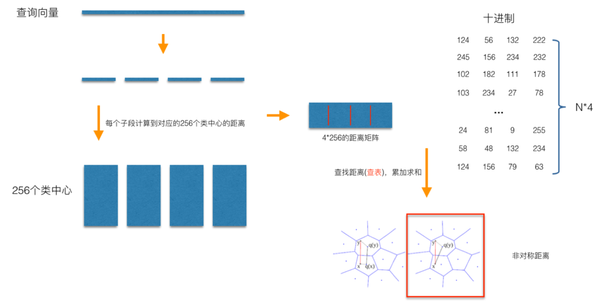
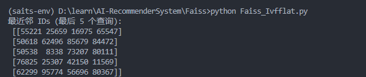
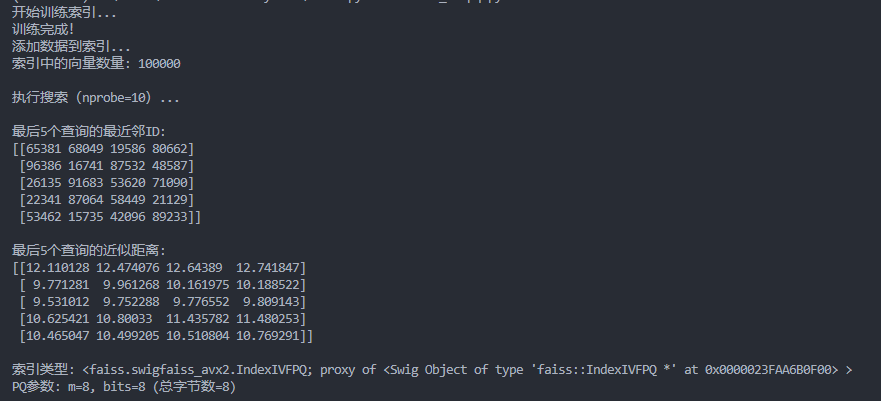

# Faiss核心原理与架构

## 1.Faiss简介

如果用暴力搜索的方法，能够得到完全正确的“标准答案”，但是其时间复杂度为O(mn)，这根本无法接受。如果牺牲一些精度的话，比如允许与参考结果有一点点偏差，那么相似性搜索能快几个数量级。加快搜索速度还涉及到数据集的预处理，我们通常把这个预处理操作称作「索引」。我们主要关注三个评价指标：
「速度」。找到与查询最相似的k个向量要耗时多久？期望比暴力算法耗时更少，不然索引的意义何在？
「内存消耗」。该方法需要消耗多少 RAM？Faiss 支持只在 RAM 上搜索，而磁盘数据库就会慢几个数量级。
「精确度」。返回的结果列表与暴力搜索结果匹配程度如何？可以用Recall @ 10 来评估。
通常我们都会在内存资源的限制下在速度和精准度之间权衡。Faiss中提供了若干种方法实现数据压缩，包括PCA、Product-Quantization等向量压缩的方法 (当然还有其它的一些优化手段，但是PCA和PQ是最为核心的)，来存储十亿级别的数据。

## 2.Faiss原理

首先来介绍一下Faiss使用时候的数据流：

在使用Faiss的时候首先需要基于原始的向量build一个索引文件，然后再对索引文件进行一个查询操作。在第一次build索引文件的时候，需要经过Train和Add两个过程；后续如果有新的向量需要被添加到索引文件，只需要一个Add操作从而实现增量build索引，但是如果增量的量级与原始索引差不多的话，整个向量空间就可能发生了一些变化，这个时候就需要重新build整个索引文件，也就是再用全部的向量来走一遍Train和Add，至于具体是怎么Train和Add的，就关系到Faiss的核心原理了。

### 2.1 Product Quantizer(乘机量化)

矢量量化方法：即vector quantization，其具体定义为：将向量空间的点用一个有限子集来进行编码的过程。常见的聚类算法，都是一种矢量量化方法。而在ANN(Approximate Nearest Neighbor,近似最近邻) 搜索问题中，向量量化方法又以乘积量化(PQ, Product Quantization)最为典型。

#### 2.1.1 Pretrain

PQ有一个Pre-train的过程，一般分为两步操作，第一步「Cluster」，第二步「Assign」，这两步合起来就是对应到前文提到Faiss数据流的「Train」阶段，可以以一个128维的向量库为例：


1. Cluster（聚类）

- 将128维向量分成4个子空间（每个32维）。
- 对每个子空间独立运行k-means（k=256），生成4个子码本。

2. Assign（分配）

- 目的： 将每个原始向量分配到最近的聚类中心，并用聚类中心的ID（即“编码”）代表原始向量。
- 对每个向量的32维子向量，分配到对应子码本的最近中心，获得4个cluster_id（如[125, 56, 132, 222]）。
- 最终编码 = 4个ID的组合（压缩表示）。

```python
import numpy as np
import faiss

# 生成随机数据（10000个128维向量）
d = 128  # 向量维度
nb = 10000  # 向量库大小
np.random.seed(1234)
xb = np.random.random((nb, d)).astype('float32')  # 向量库
xq = np.random.random((5, d)).astype('float32')   # 5个查询向量

# --- PQ参数设置 ---
M = 4           # 子空间数量（通常整除d）
nbits = 8       # 每子空间的比特数（聚类数=2^nbits=256）

# --- Step 1: 训练PQ量化器（Cluster + Assign）---
pq = faiss.ProductQuantizer(d, M, nbits)
pq.train(xb)  # Cluster阶段：训练子空间聚类中心

# --- 正确获取码本数据 ---
# 将码本转换为numpy数组（总形状: (M * ksub, d/M)）
centroids = faiss.vector_to_array(pq.centroids).reshape(-1, d // M)
print("码本总形状:", centroids.shape)  # 输出: (1024, 32) = (4*256, 32)

# 提取第一个子空间的码本（256个中心，每个32维）
subspace0_centroids = centroids[:256]  # 前256行是第一个子空间的码本
print("子空间0的码本形状:", subspace0_centroids.shape)  # 输出: (256, 32)

# --- Step 2: 对向量库编码（Assign阶段）---
codes = pq.compute_codes(xb)  # 将向量库中的每个向量分配到最近的聚类中心
print("编码后的向量库形状:", codes.shape)  # 输出: (10000, 4)

# --- Step 3: 查询示例 ---
query_codes = pq.compute_codes(xq)
print("查询向量编码:", query_codes[0])  # 输出: [54, 123, 200, 77]

# --- 使用Faiss的IndexPQ进行全流程检索 ---
index = faiss.IndexPQ(d, M, nbits)
index.train(xb)  # 训练（Cluster）
index.add(xb)    # 添加数据（自动Assign）
k = 3            # 返回最近3个邻居
D, I = index.search(xq, k)  # D是距离，I是索引
print("最近邻索引:", I[0])
```

#### 2.2.2查询（相似的向量）

完成了PQ的Pre-train，就可以看看如何基于PQ做向量检索了。查询过程如下图所示：


1. 向量分段
   将128维向量均匀分成M=4段，每段为32维子向量。
   例如：查询向量和库向量均被分为4段：[子向量1, 子向量2, 子向量3, 子向量4]。
2. 预训练簇心（聚类）
   对每一段子向量，使用K-means聚类生成256个簇心（类中心）。
   结果：共有4组簇心（每组256个，对应4段子向量），簇心也是32维向量。
3. 预计算距离表（查表准备）
   对查询向量的每一段子向量，计算它与对应段的所有256个簇心的距离，得到一个4×256的距离矩阵。
   例如：
   第1段子向量与第1组的256个簇心的距离 → [d₁₁, d₁₂, ..., d₁₂₅₆]
   第2段子向量与第2组的256个簇心的距离 → [d₂₁, d₂₂, ..., d₂₂₅₆]
   ...共4段，每段256个距离。
4. 量化库向量
   库中的每个向量也被分成4段，每段用最近簇心的ID（0~255）表示。
   例如：某个库向量被量化为[124, 56, 132, 222]，表示：
   第1段子向量属于第1组的第124号簇心，
   第2段子向量属于第2组的第56号簇心，
   以此类推。
5. 快速距离计算（查表求和）
   计算查询向量与某个库向量的距离时，只需：
   根据库向量的量化ID查预计算的距离表。
   例如：对量化后的库向量[124, 56, 132, 222]：
   查第1段距离表中ID=124的值 → d₁
   查第2段距离表中ID=56的值 → d₂
   ...共查4次表。
   将查得的4个距离相加：d = d₁ + d₂ + d₃ + d₄。

### Inverted File System（倒排乘积量化）


IVF-PQ（Inverted File System with Product Quantization）是Faiss等库中用于高效近似最近邻搜索（ANN）的核心技术，结合了倒排索引（IVF）和乘积量化（PQ），显著减少计算量，适用于十亿级向量的快速检索。下面分步骤解析其原理和实现：

1. 粗量化（Coarse Quantization）
   K-means聚类：

   对库中所有向量（如128维）进行粗聚类，生成1024个簇心 {c₁, c₂, ..., c₁₀₂₄}（每个c_i也是128维向量）。

   示例：

   向量x₁属于簇c₅，向量x₂属于簇c₁₀₂，依此类推。

   建立倒排列表：{c₅: [x₁, x₃, ...], c₁₀₂: [x₂, ...], ...}。
2. 残差编码（Residual Encoding）
   归一化操作：

   对每个向量x_i，计算其与所属簇心c_j的残差：r_i = x_i - c_j。

   目的：消除簇内整体偏移，使PQ量化更准确（残差向量更接近零中心分布）。

   PQ量化残差：

   对残差向量r_i进行乘积量化（分段+子空间聚类），存储为PQ编码（如[ID1, ID2, ID3, ID4]）。
3. 查询流程
   定位感兴趣簇：

   计算查询向量q与所有粗簇心的距离，选出最近的N个簇（如N=5）。

   检索候选向量：

   从倒排列表中取出这N个簇下的所有向量（原本需遍历1亿条，现在可能只需查50万条）。

   PQ距离计算：

   对候选向量，用PQ查表法计算与q的距离（如d = d₁ + d₂ + d₃ + d₄）。

   返回Top-K结果：

   对候选向量的距离排序，返回最相似的K个。

## 3. Faiss应用

### 3.1 IndexFlatL2

这种索引的方式是用暴力的(brute-force)精确搜索计算L2距离。

```python
import faiss
import numpy as np

# 参数设置
d = 128                         # 向量维度
num_vectors = 100000            # 索引中的向量数量
num_queries = 10000             # 查询数量
k = 4                           # 返回最近邻的数量

# 模拟数据：随机生成索引向量和查询向量 (正态分布)
np.random.seed(42)              # 固定随机种子以便复现
xb = np.random.rand(num_vectors, d).astype('float32')  # 索引数据 (100000, 128)
xq = np.random.rand(num_queries, d).astype('float32')  # 查询数据 (10000, 128)

# 构建索引并添加数据
index = faiss.IndexFlatL2(d)    # 使用L2距离（欧氏距离）
index.add(xb)                   # 添加索引数据
print("索引中的向量数量:", index.ntotal)  # 应输出 100000

# 执行搜索
D, I = index.search(xq, k)      # D: 距离矩阵 (10000, 4), I: 索引矩阵 (10000, 4)

# 输出前5个查询的最近邻ID
print("\n前5个查询的最近邻ID:")
print(I[:5])

# 可选：输出前5个查询的距离
print("\n前5个查询的距离:")
print(D[:5])

```
运行结果


### 3.2 IndexIVFFlat
IndexIVFFlat 是 Faiss 中的一种倒排索引（Inverted File Index, IVF）结构，用于加速最近邻搜索。它通过空间分区减少计算量，适用于大规模向量搜索场景（如百万级以上数据）。

Voronoi Cells（空间分区）
将整个向量空间划分为 nlist 个 Cell（类似于聚类），每个 Cell 包含一部分数据向量。

 - 训练阶段：通过聚类（如 k-means）确定每个 Cell 的中心点（由 quantizer 完成）。

- 查询阶段：只需搜索与查询向量最近的 nprobe 个 Cell 内的数据，大幅减少计算量。

倒排索引（Inverted Index）
维护一个从 Cell → 向量列表 的映射，快速定位候选数据。

```python
import faiss
import numpy as np

d = 128                           # 向量维度
nlist = 100                       # Cell 数量
k = 4                             # 返回最近邻数
nprobe = 10                       # 搜索的 Cell 数

# 生成随机数据
np.random.seed(42)
xb = np.random.rand(100000, d).astype('float32')  # 数据库向量
xq = np.random.rand(100, d).astype('float32')    # 查询向量

# 构建索引
quantizer = faiss.IndexFlatL2(d)
index = faiss.IndexIVFFlat(quantizer, d, nlist, faiss.METRIC_L2)
index.train(xb)                    # 训练聚类
index.add(xb)                      # 添加数据
index.nprobe = nprobe              # 设置搜索范围

# 查询
D, I = index.search(xq, k)
print("最近邻 IDs (最后 5 个查询):\n", I[-5:])
```

运行结果




### 3.3 IndexIVFPQ
IndexFlatL2 和 IndexIVFFlat都要存储所有的向量数据。对于超大规模数据集来说，可能会不大现实。因此IndexIVFPQ索引可以用来压缩向量，具体的压缩算法就是PQ。
```python
import faiss
import numpy as np

# 参数设置
d = 128                         # 向量维度
nlist = 100                     # 聚类中心数量（Voronoi Cells数量）
m = 8                           # 分段数量（乘积量化参数）
bits = 8                        # 每段的编码位数（总字节数 = m * bits / 8）
k = 4                           # 返回最近邻的数量
nprobe = 10                     # 搜索的聚类中心数量

# 生成模拟数据
np.random.seed(1234)            # 固定随机种子保证可复现
xb = np.random.rand(100000, d).astype('float32')  # 数据库向量 (100000, 128)
xq = np.random.rand(100, d).astype('float32')     # 查询向量 (100, 128)

# 构建索引
quantizer = faiss.IndexFlatL2(d)  # 用于分配向量的量化器（使用L2距离）
index = faiss.IndexIVFPQ(quantizer, d, nlist, m, bits)  # 乘积量化索引

# 训练阶段（聚类 + PQ码本学习）
print("开始训练索引...")
index.train(xb)                  # 同时训练聚类和PQ码本
print("训练完成！")

# 添加数据到索引
print("添加数据到索引...")
index.add(xb)                    # 将数据编码为PQ并分配到对应的Cell
print(f"索引中的向量数量: {index.ntotal}")

# 设置搜索范围
index.nprobe = nprobe            # 搜索的Cell数量（默认nprobe=1）

# 执行搜索
print(f"\n执行搜索（nprobe={nprobe}）...")
D, I = index.search(xq, k)       # D: 近似距离矩阵 (100, 4), I: 索引矩阵 (100, 4)

# 输出结果
print("\n最后5个查询的最近邻ID:")
print(I[-5:])                    # 最后5次查询的top-k结果

print("\n最后5个查询的近似距离:")
print(D[-5:])                    # 对应的近似距离

# 验证索引类型和参数
print("\n索引类型:", index)
print("PQ参数: m={}, bits={} (总字节数={})".format(m, bits, m * bits // 8))
```
运行结果

