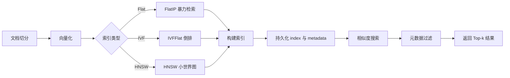
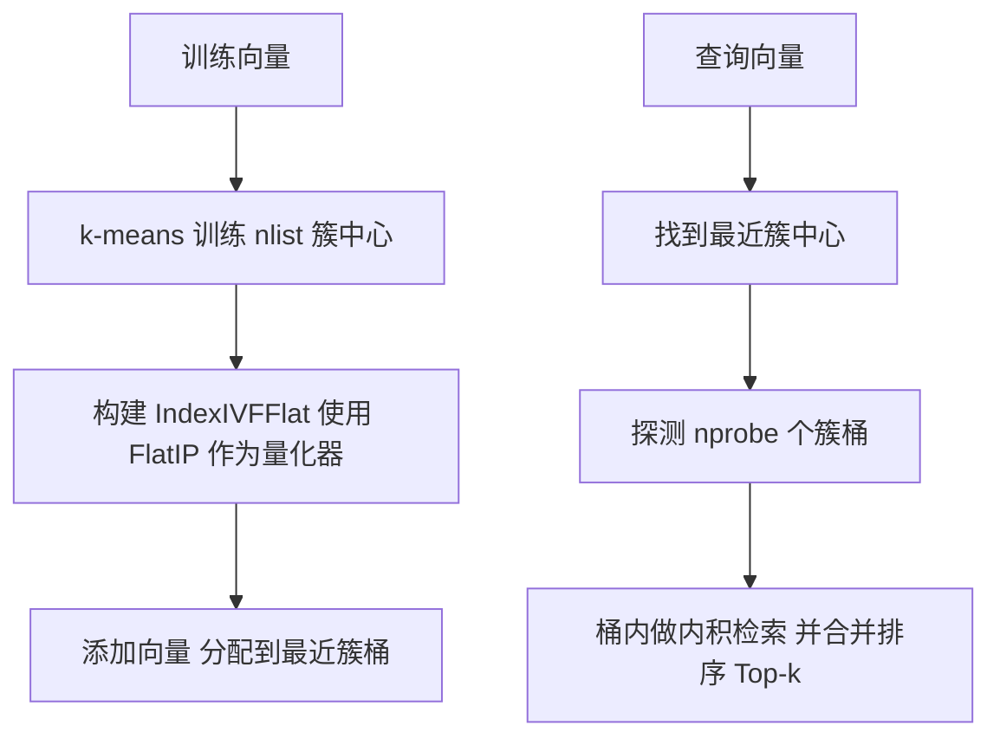
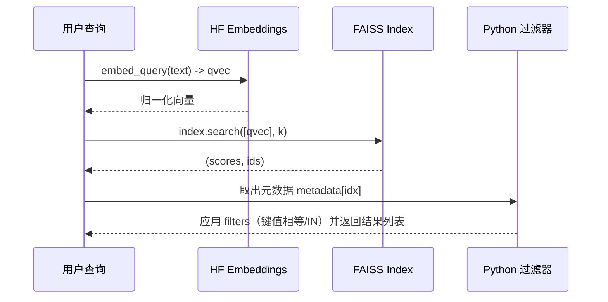
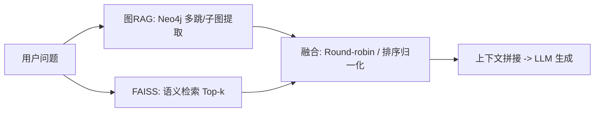

# 用于图RAG的 FAISS 向量索引模块深度解析与实践

FAISSIndexConstructionModule

- 嵌入：HuggingFaceEmbeddings（BAAI/bge-small-zh-v1.5），单位向量（normalize_embeddings=True）
- 索引类型：Flat、IVF、HNSW 三选一
- 持久化：faiss.write_index + pickle 保存元数据与配置
- 检索：index.search + 简单的后置过滤器（Python 层）

## 1. FAISS 是什么，解决什么问题

- FAISS（Facebook AI Similarity Search）是一个高性能相似度搜索库，支持大规模向量的最近邻检索（Approximate Nearest Neighbor, ANN）。
- 对于 RAG（检索增强生成）系统，FAISS 承担“向量数据库”角色：将文本嵌入向量化并索引，支持输入查询向量后快速找回最相似的文本块。
- 相比远程向量数据库（如 Milvus），FAISS 轻量、易部署（本地文件即可），非常适合单机与开发环境；在调优参数与压缩策略得当的情况下，性能也非常出色。

## 2. 模块的职责边界与数据流

从你的模块看，它承担了“向量化 + 建索引 + 持久化 + 检索 + 增量添加 + 统计/删除”的完整闭环。



- 嵌入阶段：使用 BGE-small-zh-v1.5，将文本编码为 dim=512 的向量，并归一化（normalize_embeddings=True），方便用“内积（Inner Product）= 余弦相似度”。
- 建索引阶段：支持 Flat（精确检索）、IVF（聚类倒排）、HNSW（近似图）。
- 持久化：将索引对象写入二进制文件；元数据（文本、chunk_id、recipe_name 等）和配置（维度、索引类型、nlist 等）通过 pickle 存储。
- 检索：把查询文本也向量化，再调用 index.search，拿到 (scores, ids) 并拼上元数据。
- 过滤：Python 层面的字段相等/IN 过滤（后置，非索引内置过滤）。
- 增量：add_documents 新增向量与元数据，并再次保存索引与持久化文件。

## 3. 嵌入与相似度度量的要点

- 该模块设置 normalize_embeddings=True，使得向量都被 L2 归一化。
- 归一化后，内积（Inner Product, IP）与余弦相似度一致：
  - cos(u, v) = u · v（当 ||u||=||v||=1）
- 因此：
  - IndexFlatIP、IndexIVFFlat(quantizer=IndexFlatIP) 的分值“越大越相似”，与代码注释一致。
  - 若用 HNSW 默认 L2 距离，需保证分值含义不要混淆（详见第 7 节陷阱与修复建议）。

## 4. 三类索引的工作原理与适用场景

### 4.1 Flat（IndexFlatIP）

- 原理：逐个向量暴力比较，返回最相似的 k 个。
- 优点：结果精确；实现简单；无需训练。
- 缺点：数据量上万以上时，查询延迟显著上升。
- 适合：小规模数据集（几千到一两万向量以内）或离线评测基线。

### 4.2 IVF（IndexIVFFlat）

- 原理：先用 k-means 把向量聚成 nlist 个簇；查询时只在最相近的若干簇内搜索（靠 nprobe 控制）。
- 训练：index.train(vectors) 必须先进行（已在代码实现）。
- 核心参数：
  - nlist：聚类中心数（倒排桶的个数）；经验上设为 N/10 到 N/50（N 为向量数），你的代码里取 min(self.nlist, N//10)，保证每桶样本不太少。
  - nprobe：查询时要检查的桶的数量。值越大，召回率越高但越慢。你的代码未设置，建议加。
- 优点：检索速度和召回率可折中，适合大多数中大型数据集。
- 缺点：需要训练；参数需要调优。



### 4.3 HNSW（IndexHNSWFlat）

- 原理：分层小世界图，近似最邻近搜索；参数 M 控制连边数量；查询时 efSearch 控制候选集大小，训练时 efConstruction 控制构建质量。
- 优点：无需训练；高性能，高召回；支持动态 add。
- 缺点：默认度量是 L2（在你的代码里），若想用 IP/余弦需要额外设置；内存占用相对偏高。
- 适合：高性能在线检索、数据动态增长的场景。

代码里设置：

- M=32，efConstruction=200，efSearch=64：这是较常见的设置，能获得较好的召回/速度平衡。

## 5. 构建索引的关键步骤（与代码对应）

1. 读取文档块（chunks: List[Document]）
2. 抽出文本并向量化（embed_documents -> np.float32）
3. 根据 index_type 创建索引实例
4. IVF 需要训练（index.train(vectors)）
5. index.add(vectors) 写入所有向量
6. 构造元数据数组 self.metadata 与映射 self.id_to_index
7. 调用 save_index 持久化（faiss.index + metadata.pkl + config.pkl）
8. 标记 index_ready=True

小贴士：

- 初次构建时尽可能一次性 add 全量数据，便于 IVF 训练收敛；后续增量 add 是支持的。
- 对超大数据集，优先选择 IVF 或 IVF_PQ（见第 9 节增强建议）。

## 6. 相似度搜索流程与结果组装



- 在你的代码中，Flat 与 IVF 都采用 Inner Product（IP）度量；对归一化向量，score 越大越相似。
- HNSW 默认 L2（你的写法），需要特别注意分值的含义（见第 7 节）。
- 过滤是后置的（在 Python 端），即先取回 top-k，再按 metadata 筛；如果 filter 很强，最好“过采样”k（例如取 k*3）再过滤以减少被过滤光的概率。

## 7. 常见陷阱与修复建议（强烈建议在你的教程中强调）

1) HNSW 的度量与分值含义不一致

- 你的 Flat/IVF 用 IndexFlatIP（IP=cosine），score 越大越相似；
- 你的 HNSW 用 IndexHNSWFlat(self.dimension, 32) 默认是 L2 距离，数值越小越相似；
- 你的 similarity_search 里注释“FAISS返回的是内积分数，值越大相似度越高”只对 IP 成立；对 L2 不成立。
  解决方案（任选其一）：
- 统一使用 IP 度量：
  - 在 FAISS 1.7.4+ 可尝试用 IndexHNSWFlat(dim, M, faiss.METRIC_INNER_PRODUCT)，或
  - 创建后设置 index.metric_type = faiss.METRIC_INNER_PRODUCT（支持情况依版本而异）。
- 或者，若继续用 L2，则在返回前将 score 映射为相似度（例如相似度 = 2 - 距离，或取负号）并标注清楚。

2) IVF 未设置 nprobe（影响召回）

- 你的代码训练后没有设置 index.nprobe，默认 nprobe=1 往往召回偏低。
  建议：

```python
# 在 _create_index 之后、search 之前设置
if isinstance(self.index, faiss.IndexIVFFlat):
    self.index.nprobe = min(16, self.nlist)  # 经验值，可入参化
```

3) 过滤在 Python 层后置执行

- 如果 filter 条件严格（如强筛某 category），先取回 k 条再过滤可能为空。
  建议：
- 增大检索 k（如 k*3）再过滤；
- 或者为不同类目建立分区/子索引（复杂度提升）；
- 或者记录多字段倒排（非 FAISS 提供，需要与业务层配合）。

4) 维度/模型不一致的风险

- config.pkl 里保存了 dimension、model_name；加载时需确保一致，否则搜索行为不可预期。
  建议：
- 加载时严格校验维度；长远考虑加入版本号与校验逻辑。

5) 内存与持久化

- FAISS 索引常驻内存；大型 IVF/HNSW 索引可能占用较大内存。
- 保存/加载是原子文件写读，注意文件权限与路径存在性。

6) 多线程并发

- faiss.Index 通常是线程安全的“读多写少”；并发检索没问题，但并发 add/训练需谨慎。
- 建议：构建期单线程；服务期只读检索。

## 8. 指标与统计

get_collection_stats 返回：

- row_count：元数据条数
- index_type、dimension
- index_size = index.ntotal
- is_trained：IVF/HNSW 的训练状态（Flat 恒为 True）

这有助于在仪表盘/日志中观测索引健康状态。

## 9. 性能调优与增强建议（生产化实践）

- IVF 家族：
  - 调 nlist（越大越细粒度，训练时间↑；查询速度/召回权衡）
  - 设置 nprobe（召回↑、耗时↑）
  - 使用 PQ/OPQ 压缩（IndexIVFPQ、OPQMatrix + IVFPQ），大幅降内存/磁盘占用，牺牲少量精度
- HNSW 家族：
  - M（图稠密度）、efConstruction（建图质量）、efSearch（查询候选集）共同决定速度/召回
- GPU 加速：
  - 使用 faiss-gpu，将索引转移到 GPU（IndexShards + GpuIndexFlatIP / IVF on GPU）
- Sharding/并行：
  - 通过索引分片（IndexShards）实现多核/多机并行检索
- 召回与过滤协同：
  - 对严格过滤场景，分桶/分区构建索引，避免后置过滤导致的召回不足
- 分数融合策略：
  - 若与 BM25/图检索结合（如你的 GraphRAG/混合检索），建议标准化各源分值后再做融合（round-robin 或加权）

## 10. 与图 RAG 的关系（如何嵌入你的图RAG项目）

在你的项目中，FAISS 模块承担的是“向量召回”角色，属于“传统/语义检索”一侧；而“图 RAG”则通过 Neo4j 进行实体-关系级推理。典型组合方式如下：



- 你的 HybridRetrievalModule 就是做 R1+R2 的融合（包括 BM25 + FAISS + 图索引 KV）；
- FAISS 的得分（IP 分数）会用于最终排序/合并（注意与图检索的“相关性分”统一规范化）。

## 11. 代码级改进建议（可直接贴到你的教程里）

- 统一 HNSW 度量或转换分值语义：

```python
elif self.index_type == "HNSW":
    # 注意：若FAISS版本支持，可直接指定IP度量
    try:
        index = faiss.IndexHNSWFlat(self.dimension, 32, faiss.METRIC_INNER_PRODUCT)
    except TypeError:
        index = faiss.IndexHNSWFlat(self.dimension, 32)
        if hasattr(index, "metric_type"):
            index.metric_type = faiss.METRIC_INNER_PRODUCT
    index.hnsw.efConstruction = 200
    index.hnsw.efSearch = 64
```

- 给 IVF 搜索设置 nprobe，并提供配置项：

```python
# 创建完索引或加载后：
if isinstance(self.index, faiss.IndexIVFFlat):
    # 可从 config 中读取 nprobe，给默认值
    self.index.nprobe = max(1, min(16, self.nlist))
```

- 搜索时“过采样 + 过滤”：

```python
raw_k = int(k * 3) if filters else k
scores, indices = self.index.search(query_vector, raw_k)
# 再按 filters 筛选，若不足再退回
```

- 分值统一输出（避免 HNSW/L2 与 IP 的误解）：

```python
# 假设都想返回“相似度越大越好”的score
if using_L2:
    similarity = 2.0 - float(distance)  # or 1/(1+distance)
else:
    similarity = float(ip_score)
```

## 12. 最小可运行示例（教学中可直接使用）

```python
from langchain_core.documents import Document

# 1) 构造一些文档块
docs = [
    Document(page_content="宫保鸡丁的做法...", metadata={"recipe_name": "宫保鸡丁", "chunk_id": "r1_c0"}),
    Document(page_content="麻婆豆腐的做法...", metadata={"recipe_name": "麻婆豆腐", "chunk_id": "r2_c0"}),
    Document(page_content="清炒西兰花...", metadata={"recipe_name": "清炒西兰花", "chunk_id": "r3_c0"}),
]

# 2) 初始化模块
faiss_mod = FAISSIndexConstructionModule(
    index_path="./faiss_index",
    dimension=512,
    model_name="BAAI/bge-small-zh-v1.5",
    index_type="IVF",
    nlist=100
)

# 3) 构建索引
faiss_mod.build_vector_index(docs)

# 4) 查询
results = faiss_mod.similarity_search("怎么做豆腐更入味？", k=3)

for r in results:
    print(r["metadata"]["recipe_name"], r["score"])
```

运行后生成：

- faiss_index/faiss.index（二进制索引）
- faiss_index/metadata.pkl（文本与业务字段）
- faiss_index/config.pkl（维度/类型/模型等）

## 13. 调参与规模建议（经验值）

- 规模小（<= 1 万向量）：Flat 或 HNSW 即可；Flat 简单精确，HNSW 快。
- 规模中（1 万 ~ 100 万）：IVF（nlist ≈ N/10 到 N/50），nprobe 8~16；或 HNSW（M=32，efSearch=64~128）。
- 规模大（> 100 万）：IVF-PQ（压缩）或分片 + GPU；注意训练样本采样质量。

## 14. 小结

这段 FAISS 索引模块为 RAG/图 RAG 提供了“可落地”的本地语义检索能力，具备以下特点：

- 简洁：只依赖 FAISS + HuggingFace Embeddings，即可从零到检索
- 完整：包含索引构建、持久化、加载、检索、增量更新、统计与删除
- 可拓展：参数可调、可替换索引类型、可升级为 PQ/GPU/sharding

若用于生产/教程，建议再补充：

- HNSW 度量一致性处理
- IVF 的 nprobe 配置
- 分数统一化策略
- 过滤的过采样与更强“结构化过滤”方案
- GPU 与 PQ 的进阶章节

配合你的图 RAG（Neo4j 多跳/子图推理），这将成为“语义召回 + 结构推理”双引擎的关键一环。祝编写顺利，欢迎把上述图/建议直接放进你的 GitHub 教程中。
