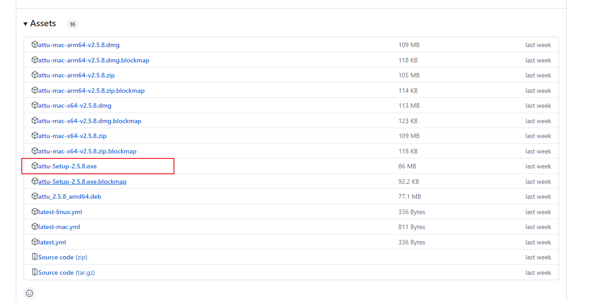

# Milvus standlone部署

## 1. 系统要求

- **操作系统**：Linux（推荐 Ubuntu 20.04+ / CentOS 7+）或 Windows（需 Docker Desktop）
- 硬件要求：
  - 内存：≥ 8GB（建议 16GB 以上）
  - 硬盘：≥ 50GB SSD（存储向量数据和日志）
- 依赖项：
  - Docker 19.03+ 和 Docker Compose 1.25.1+

> Milvus支持docker部署，因此在不同平台上具有较好的通用性，如果不了解docker 可以参考 [Docker+万字教程](https://github.com/datawhalechina/daily-interview/blob/master/%E5%BC%80%E5%8F%91/Docker%2B%E4%B8%87%E5%AD%97%E6%95%99%E7%A8%8B%EF%BC%9A%E4%BB%8E%E5%85%A5%E9%97%A8%E5%88%B0%E6%8E%8C%E6%8F%A1.pdf)

## 2.Milvus运行

在 Microsoft Windows 上安装 Docker Desktop 后，就可以在管理员模式下通过 PowerShell 或 Windows 命令提示符访问 Docker CLI。你可以在 PowerShell、Windows Command Prompt 或 WSL 2 中运行 Docker Compose 来启动 Milvus。

**从 PowerShell 或 Windows 命令提示符**

1. 在管理员模式下右击并选择**以管理员身份运行**，打开 Docker Desktop。
2. 在 PowerShell 或 Windows Command Prompt 中运行以下命令，为 Milvus Standalone 下载 Docker Compose 配置文件并启动 Milvus。

```
# Download the configuration file and rename it as docker-compose.yml
C:\>Invoke-WebRequest https://github.com/milvus-io/milvus/releases/download/v2.4.15/milvus-standalone-docker-compose.yml -OutFile docker-compose.yml

# Start Milvus
C:\>docker compose up -d
Creating milvus-etcd  ... done
Creating milvus-minio ... done
Creating milvus-standalone ... done
```

根据网络连接情况，下载用于安装 Milvus 的映像可能需要一段时间。名为**milvus-** **standalone**、**milvus-minio** 和**milvus-etcd**的容器启动后，你可以看到

- **milvus-etcd**容器不向主机暴露任何端口，并将其数据映射到当前文件夹中的**volumes/etcd**。
- **milvus-minio**容器使用默认身份验证凭据在本地为端口**9090**和**9091**提供服务，并将其数据映射到当前文件夹中的**volumes/minio**。
- **milvus-standalone**容器使用默认设置为本地**19530**端口提供服务，并将其数据映射到当前文件夹中的**volumes/milvus**。

如果安装了 WSL 2，还可以调用 Linux 版本的 Docker Compose 命令。

**从 WSL 2**

1.启动 WSL 2

```
C:\>wsl --install
Ubuntu already installed.
Starting Ubuntu...
```

2.下载 Milvus 配置文件。

```
wget https://github.com/milvus-io/milvus/releases/download/v2.4.17/milvus-standalone-docker-compose.yml -O docker-compose.yml
```

3.启动 Milvus。

```
sudo docker compose up -d

Creating milvus-etcd  ... done
Creating milvus-minio ... done
Creating milvus-standalone ... done
```


## 3.Attu安装

Attu 是一款一体化的 milvus 管理工具，Attu 旨在管理和与 Milvus 交互，提供以下功能：

- **数据库、集合和分区管理：**有效地组织和管理您的 Milvus 设置。
- **向量嵌入的插入、索引和查询：**轻松处理 Milvus 向量数据操作。
- **执行矢量搜索：**使用矢量搜索功能快速验证您的结果。
- **用户和角色管理：**轻松管理 Milvus 权限和安全性。
- **查看系统拓扑：**可视化 Milvus 系统架构，以便更好地管理和优化。

Attu 提供了2种安装的方法

### 方法一、

打开cmd命令行窗口，并执行以下代码

```
ipconfig
```

找到如下IP（WSL (Hyper-V firewall) IPv4地址）


2、执行安装attu

将以下命令中的{milvus server IP}替换**成确保 Attu 容器可以访问 Milvus 的 IP 地址**

```
docker run -p 8000:3000 -e MILVUS_URL={milvus server IP}:19530 zilliz/attu:v2.5.6
例如：
docker run -p 8000:3000 -e MILVUS_URL=172.X.X.1:19530 zilliz/attu:v2.5.6  # 根据实际的版本进行替换
```

需要注意的是，attu和milvus之间有兼容性问题，最好按照官方推荐的版本来

| Milvus 版本 | 推荐 Attu 版本                                               |
| ----------- | ------------------------------------------------------------ |
| 2.5.x       | [v2.5.6](https://github.com/zilliztech/attu/releases/tag/v2.5.6) |
| 2.4.x       | [v2.4.12](https://github.com/zilliztech/attu/releases/tag/v2.4.12) |
| 2.3.x       | [v2.3.5](https://github.com/zilliztech/attu/releases/tag/v2.3.5) |
| 2.2.x       | [v2.2.8](https://github.com/zilliztech/attu/releases/tag/v2.2.8) |
| 2.1.x       | [v2.2.2](https://github.com/zilliztech/attu/releases/tag/v2.2.2) |

等待执行完毕


在浏览器打开：http://127.0.0.1:8000/


### 方法二、

attu 官方提供了windows系统独立安装包，[下载链接](https://github.com/zilliztech/attu/releases/tag/v2.5.8)


安装完成以后

