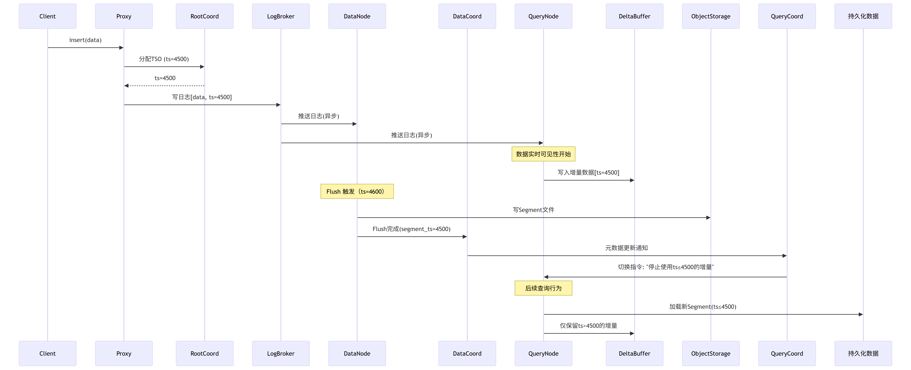

# 《Milvus 文档》

Milvus 是一款开源向量数据库，适配各种规模的 AI 应用，在本指南中，将引领你在数分钟内完成 Milvus 的本地设置，并借助 Python 客户端库实现向量的生成、存储与搜索。这里运用的 Milvus Lite，是pymilvus中包含的 Python 库，可嵌入客户端应用程序。
你需要先理解：

1. 什么是 “向量”？
你可以把 “向量” 理解成一串数字组成的 “特征密码”。生活中任何东西（比如一张图片、一句话、一个水果）都有自己的特征，向量就是把这些特征转换成数字的形式，方便后续进行相似度检索。

举个例子：

比如描述一个苹果，它的特征可能是：颜色（红色 = 1，绿色 = 0）、形状（圆形 = 1，方形 = 0）、甜度（0-10 分，假设 8 分）、大小（直径 5cm=5）。
那这个苹果的向量可能就是 [1, 1, 8, 5]—— 这串数字就代表了苹果的 “特征密码”。

在 AI 里，图片、文字都会被转换成这样的向量。比如一句话 “我爱吃苹果”，AI 会提取它的语义特征，变成一串更长的数字（比如 128 个数字），这就是 “文本向量”。

2. 什么是 “向量数据库”？
普通数据库（比如 Excel 表格）存的是文字、数字（比如 “苹果，红色，5 元”），而向量数据库专门存上面说的 “向量”（也就是 “特征密码”）。

为啥要专门存向量？因为 AI 处理数据时，不是直接比文字，而是比向量。比如想找和 “我爱吃苹果” 意思相似的句子，AI 会先把这句话转成向量，再去向量数据库里找 “数字长得最像” 的向量，对应的句子就是相似的。

Milvus 就是这样一个专门存向量的数据库，就像 “向量的仓库”。
## 快速入门
1. 设置向量数据库
要创建本地的 Milvus 向量数据库，仅需实例化一个`MilvusClient`，并指定用于存储所有数据的文件名，如`"milvus_demo.db"`。
```python
client = MilvusClient("milvus_demo.db")
```
在 Milvus 里，需要借助 `Collections` 来存储向量及其相关元数据，可将其类比为传统 SQL 数据库中的表格。创建 `Collections` 时，能定义 `Schema` 和索引参数，以此配置向量规格，包括维度、索引类型和远距离度量等。此外，还有一些复杂概念用于优化索引，提升向量搜索性能。但就目前而言，重点关注基础知识，并尽量采用默认设置。至少，需设定 Collections 的名称和向量场的维度。例如：
```python
from pymilvus import CollectionSchema, FieldSchema, DataType

fields = [
    FieldSchema(name="id", dtype=DataType.INT64, is_primary=True),
    FieldSchema(name="vector", dtype=DataType.FLOAT_VECTOR, dim=128)
]
schema = CollectionSchema(fields)
client.create_collection("my_collection", schema)
```
上述代码中，主键和向量字段采用默认名称`（"id"和"vector"）`，度量类型（向量距离定义）设为默认值（COSINE） 。
2. 插入向量
Milvus 期望数据以字典列表的形式插入，每个字典代表一条数据记录，称作一个实体。假设已有向量化后的数据vectors（为浮点数数组列表），以及对应的实体 ID 列表ids，可按如下方式插入数据：
```python
entities = [
    {"id": id, "vector": vector}
    for id, vector in zip(ids, vectors)
]
client.insert("my_collection", entities)
```
3. 向量搜索
Milvus 可同时处理一个或多个向量搜索请求。`query_vectors`变量是一个向量列表，其中每个向量都是一个浮点数数组。
```python
query_vectors = embedding_fn.encode_queries(("Who is Alan Turing?",))
```
执行搜索的示例代码如下：
```python
results = client.search(
    collection_name="my_collection",
    query_vectors=query_vectors,
    top_k=5,
    output_fields=["id"]
)
```
输出结果是一个结果列表，每个结果对应一个向量搜索查询。每个查询包含一个结果列表，其中每个结果涵盖实体主键、到查询向量的距离，以及指定output_fields的实体详细信息。
还能在过滤指定的标量（标量指非向量数据）的同时进行向量搜索，可通过指定特定条件的过滤表达式达成。例如，假设集合中存在一个名为"category"的标量字段，要搜索"category"为"tech"的相关向量，可这样操作：
```python
expr = 'category == "tech"'
results = client.search(
    collection_name="my_collection",
    query_vectors=query_vectors,
    top_k=5,
    output_fields=["id"],
    expr=expr
)
```
4. 加载现有数据
由于 Milvus Lite 的所有数据都存储于本地文件，即便程序终止，也能通过创建带有现有文件的MilvusClient，将所有数据加载至内存。例如，恢复"milvus_demo.db"文件中的集合，并继续写入数据：
```python
client = MilvusClient("milvus_demo.db")
collection = client.get_collection("my_collection")
```
## Collection
每个数据库中可包含多个Collection，类似于关系数据库中的表和记录。
Collection是一个二维表格，拥有固定的列和行，每一列表示一个字段，每一行表示一个实体，
### 构建Collection
构建一个Collection需要如下三个步骤：

1. 需要创建Schema，Schema定义了Collection的列和字段的类型。
2. 设置索引参数（可选）。
3. 创建Collection

首先，对于Schema，参考如下代码：
```python
        # 连接Milvus服务器
        connections.connect("default", host="localhost", port="19530")

        # 检查并创建collection
        collection_name = 'video_push'
        fields = [
            FieldSchema(name="id", dtype=DataType.INT64, is_primary=True, auto_id=False),
            FieldSchema(name="content", dtype=DataType.VARCHAR, max_length=1024),
            FieldSchema(name="embedding", dtype=DataType.FLOAT_VECTOR, dim=1024),
            # 你可以选择构建一些其他的字段
        ]
        schema = CollectionSchema(fields, collection_name)
        collection = Collection(name=collection_name, schema=schema)
```
其次创建索引，加载集合
```python
        collection.create_index(
            # 索引字段名
            field_name="embedding",
            # 索引参数设置
            index_params={
                "metric_type": "IP",
                "index_type": "IVF_FLAT",
                "params": {"nlist": 1024}
            }
        )
        collection.load()
```
你可以使用如下代码检查你数据库中存在的Collection:
```python
res = client.describe_collection(
    collection_name="quick_setup"
)

print(res)

```
您可以按以下方式重命名一个 Collection:
```python
client.rename_collection(
    old_name="video_push",
    new_name="Dw_easy_vectorDB"
)
```
Milvus在查询时速度很快，是因为每次加载的Collection的数据会缓存在内存中。为了减少内存的消耗，您可以使用动态字段的方式加载你需要的数据进入Milvus。
```python
client.load_collection(
    collection_name="Dw_easy_vectorDB",
    load_fields=["id", "embedding"]
    skip_load_dynamic_field=True 
)
```
这样做除了能减少内存的消耗外，还有一个好处，即后续使用GPU HMB和SSD对大规模数据进行优化存储和加速检索时，id字段所占用的空间非常小，往往只有几bit，在CPU和SSD、HMB之间传输时，性能差异不大，因此可以忽略消耗。
关于这一部分，请学习完成所有知识后，浏览[FusionANNS]()。

当你使用结束此Collection后，请及时释放Collection，释放内存。
```python
client.release_collection(
    collection_name="Dw_easy_vectorDB"
)

res = client.get_load_state(
    collection_name="Dw_easy_vectorDB"
)

print(res)
```
如果你的使用场景是大模型问答系统，对于用户提供的信息数据，你需要快速的向量化存储，以便提供更加高质量的回答，并且你使用的模型上下文比较短的情况下，可以通过设置Collection的TTL来实现。用户投喂的大规模文档数据，存储到Milvus中，并设置TTL，Milvus会自动删除过期的数据。
你可以使用如下代码来实现：
```python
#  创建新的集合
from pymilvus import MilvusClient

client.create_collection(
    collection_name="Dw_easy_vectorDB",
    schema=schema,
    properties={
        "collection.ttl.seconds": 604800 # 7天
    }
)

```
```python
#  修改已存在的集合
client.alter_collection_properties(
    collection_name="Dw_easy_vectorDB",
    properties={"collection.ttl.seconds": 604800}
)
```

### Collection中设置数据分区
当你第一次创建一个Collection时，所有的数据都会被存储在一个默认分区中。然而，为了更好地管理数据，你可以创建多个分区，并将数据分布到这些分区中。分区可以让你更有效地管理和查询数据，例如，你可以根据时间戳将数据分布到不同的分区中，以便按时间范围查询数据。

创建分区：
```python
client.create_partition(
    collection_name="Dw_easy_vectorDB",
    partition_name="partition_1"
)
```
删除分区：
```python
client.drop_partition(
    collection_name="Dw_easy_vectorDB",
    partition_name="partition_1"
)
```
查询分区：
```python
client.list_partitions(
    collection_name="Dw_easy_vectorDB"
)
```
向分区中插入数据：
```python
client.insert(
    collection_name="Dw_easy_vectorDB",
    partition_name="partition_1",
    entities=entities
)
```
查询分区中的数据：
```python
client.query(
    collection_name="Dw_easy_vectorDB",
    expr="partition_name == 'partition_1'",
)
```
不过，对于某些问答系统，分区的设计会影响查询性能。我们很难确定对于某一个问题的答案，应该从哪个分区中查询，除此之外，我们不能保证另一个不相干的分区中是否包含了某条可能对最终回答产生重要影响的数据。所以，不建议使用分区。

### 索引
参考[Milvus 索引介绍](./milvus%20索引介绍.md)
## 基本向量搜索
核心概念：ANN 搜索和 kNN 搜索
这俩是向量搜索的两种方式，先搞懂它们的区别。
1. 什么是 “kNN 搜索”？
全称是 “k 近邻搜索”。简单说就是：拿你的查询向量，和数据库里所有向量一个个比，找出最像的前 k 个（k 是你指定的数量，比如前 5 个）。

举个例子：
你有 1000 张动物图片，每张都转成了向量。现在你拿一张 “猫” 的图片向量去搜，kNN 会把这张向量和 1000 张的向量全比一遍，最后挑出最像的 5 张（大概率也是猫）。

缺点：如果数据库里有 10 亿个向量，一个个比就太慢了，像在 10 亿本书里找一本相似的，从头翻到尾，耗时又耗力。

2. 什么是 “ANN 搜索”？
全称是 “近似近邻搜索”。它不跟所有向量比，而是用 “偷懒” 的办法：提前给向量做 “分类整理”（也就是建 “索引”），然后只在 “可能相似的小范围” 里找，最后返回差不多像的前 k 个。

还是刚才的例子：
提前把 1000 张动物图片分好类（比如 “猫科”“犬科”“鸟类”），建一个 “索引”（类似分类标签）。搜 “猫” 的向量时，ANN 会先通过索引定位到 “猫科” 分类，只在这个小分类里比，不用看犬科和鸟类，速度就快多了。

特点：虽然可能不是 100% 最像的（但差距很小），但速度快太多，适合大数据量的场景（比如手机上的图片搜索、聊天机器人回答问题）。

1. ANN 搜索基础
与 kNN 的区别：kNN 需比较所有向量，耗时耗资源；ANN 依赖预建索引文件，快速定位相似向量子组，平衡性能与正确性。
AUTOINDEX：自动分析集合数据分布，优化索引参数，降低使用门槛，适配多种度量类型。
度量类型：不同度量方式对应不同相似度判断标准，如L2（值越小越相似）、IP（值越大越相似）等，距离范围各有不同。
1. 主要搜索操作
* 单向量搜索：针对单个查询向量，根据索引和度量类型返回前 K 个最相似向量。
* 批量向量搜索：同时处理多个查询向量，Milvus 并行执行搜索并返回对应结果集，代码结构与单向量类似，仅需传入向量列表。
* 分区中的 ANN 搜索：通过指定partition_names参数将搜索范围限制在特定分区，减少数据量以提升性能，适用于集合内有多个分区的场景。
* 使用输出字段：默认返回主键和距离，可通过output_fields指定额外字段（如color），使结果包含更多实体信息。
* 限制与偏移：limit控制单次返回结果数（top-K），offset用于分页查询（跳过指定数量结果），两者总和需小于 16384。


了解完这些基本的概念后，我们可以开始编写代码来使用 Milvus 进行搜索。


### 标量查询（Query）

与向量搜索不同，标量查询主要用于根据标量字段的条件来检索数据，不涉及向量相似度计算。

#### 基本查询操作

```python
from pymilvus import MilvusClient

client = MilvusClient("http://localhost:19530")

# 1. 查询所有数据
results = client.query(
    collection_name="product_recommendation",
    expr="",  # 空表达式表示查询所有数据
    output_fields=["id", "category", "brand", "price"]
)

print("所有商品数据：")
for result in results:
    print(f"ID: {result['id']}, 类别: {result['category']}, "
          f"品牌: {result['brand']}, 价格: {result['price']}")
```

#### 条件查询

```python
# 2. 基于单个条件查询
results = client.query(
    collection_name="product_recommendation",
    expr='category == "electronics"',
    output_fields=["id", "category", "brand", "price"]
)

print("电子产品：")
for result in results:
    print(f"ID: {result['id']}, 品牌: {result['brand']}, 价格: {result['price']}")

# 3. 基于数值范围查询
results = client.query(
    collection_name="product_recommendation",
    expr='price >= 100 and price <= 1000',
    output_fields=["id", "category", "brand", "price"]
)

print("价格在100-1000之间的商品：")
for result in results:
    print(f"ID: {result['id']}, 类别: {result['category']}, "
          f"品牌: {result['brand']}, 价格: {result['price']}")
```

#### 复杂查询表达式

```python
# 4. 使用 IN 操作符
results = client.query(
    collection_name="product_recommendation",
    expr='category in ["electronics", "clothing"] and price < 500',
    output_fields=["id", "category", "brand", "price"]
)

# 5. 使用 LIKE 操作符（字符串模糊匹配）
results = client.query(
    collection_name="product_recommendation",
    expr='brand like "App%"',  # 查找以"App"开头的品牌
    output_fields=["id", "category", "brand", "price"]
)

# 6. 使用逻辑运算符组合条件
results = client.query(
    collection_name="product_recommendation",
    expr='(category == "electronics" and price > 500) or (category == "clothing" and price < 100)',
    output_fields=["id", "category", "brand", "price"]
)
```

#### 查询结果限制和排序

```python
# 7. 限制返回结果数量
results = client.query(
    collection_name="product_recommendation",
    expr='category == "electronics"',
    output_fields=["id", "category", "brand", "price"],
    limit=10  # 只返回前10条结果
)

# 8. 使用偏移量实现分页
results = client.query(
    collection_name="product_recommendation",
    expr='category == "electronics"',
    output_fields=["id", "category", "brand", "price"],
    limit=10,
    offset=20  # 跳过前20条，返回第21-30条
)
```

### 数据删除操作

Milvus 支持根据条件删除数据，删除操作是异步执行的。

```python
# 1. 根据主键删除
client.delete(
    collection_name="product_recommendation",
    expr="id in [1, 2, 3]"  # 删除ID为1,2,3的记录
)

# 2. 根据条件删除
client.delete(
    collection_name="product_recommendation",
    expr='category == "discontinued" and price < 10'  # 删除停产且价格低于10的商品
)

# 3. 删除特定品牌的所有商品
client.delete(
    collection_name="product_recommendation",
    expr='brand == "OldBrand"'
)

print("删除操作已提交，正在异步执行...")
```

### 数据更新操作（Upsert）

Milvus 支持 Upsert 操作，即如果数据存在则更新，不存在则插入。

```python
# 准备更新数据
upsert_data = [
    {
        "id": 1,  # 如果ID=1存在，则更新；否则插入
        "category": "electronics",
        "brand": "Apple",
        "price": 1099.99,  # 更新价格
        "embedding": [0.1, 0.2, 0.3, ...]  # 更新向量
    },
    {
        "id": 100,  # 新的ID，将被插入
        "category": "electronics",
        "brand": "Google",
        "price": 599.99,
        "embedding": [0.4, 0.5, 0.6, ...]
    }
]

# 执行 Upsert 操作
client.upsert(
    collection_name="product_recommendation",
    data=upsert_data
)

print("Upsert 操作完成")
```

### 数据统计和聚合

```python
# 1. 统计总记录数
count_result = client.query(
    collection_name="product_recommendation",
    expr="",
    output_fields=["count(*)"]
)
print(f"总记录数: {count_result[0]['count(*)']}")

# 2. 按条件统计
electronics_count = client.query(
    collection_name="product_recommendation",
    expr='category == "electronics"',
    output_fields=["count(*)"]
)
print(f"电子产品数量: {electronics_count[0]['count(*)']}")

# 3. 统计不同类别的商品数量
categories = ["electronics", "clothing", "books"]
for category in categories:
    count = client.query(
        collection_name="product_recommendation",
        expr=f'category == "{category}"',
        output_fields=["count(*)"]
    )
    print(f"{category} 商品数量: {count[0]['count(*)']}")
```

## 混合搜索（Hybrid Search）

混合搜索是 Milvus 的高级功能，允许同时进行向量搜索和标量过滤，实现更精确的查询结果。

### 向量搜索 + 标量过滤
```python
# 1. 基本混合搜索
query_vector = [0.1, 0.2, 0.3, ...]

results = client.search(
    collection_name="product_recommendation",
    data=[query_vector],
    limit=10,
    # 向量搜索的同时进行标量过滤
    expr='category == "electronics" and price >= 500 and price <= 1500',
    output_fields=["id", "category", "brand", "price"]
)

print("混合搜索结果（电子产品，价格500-1500）：")
for hits in results:
    for hit in hits:
        print(f"ID: {hit['id']}, 品牌: {hit['entity']['brand']}, "
              f"价格: {hit['entity']['price']}, 相似度: {hit['distance']}")
```

### 多条件复合过滤

```python
# 2. 复杂条件组合
results = client.search(
    collection_name="product_recommendation",
    data=[query_vector],
    limit=5,
    # 复杂的过滤条件
    expr='(category == "electronics" and brand in ["Apple", "Samsung"]) or (category == "clothing" and price < 200)',
    output_fields=["id", "category", "brand", "price"]
)

# 3. 时间范围过滤（假设有时间字段）
# 注意：需要在Schema中定义时间字段
results = client.search(
    collection_name="product_recommendation",
    data=[query_vector],
    limit=10,
    expr='category == "electronics" and created_time >= "2024-01-01" and created_time <= "2024-12-31"',
    output_fields=["id", "category", "brand", "price", "created_time"]
)
```

### 地理位置搜索示例

```python
# 假设有地理位置相关的Collection
# 4. 地理位置范围搜索
results = client.search(
    collection_name="location_based_products",
    data=[query_vector],
    limit=10,
    # 搜索特定地理范围内的商品
    expr='latitude >= 39.9 and latitude <= 40.1 and longitude >= 116.3 and longitude <= 116.5',
    output_fields=["id", "name", "latitude", "longitude", "category"]
)
```

## 批量操作和事务

### 批量插入优化

```python
# 1. 大批量数据插入
def batch_insert_large_data(client, collection_name, data, batch_size=1000):
    """
    分批插入大量数据，避免单次插入过多导致的性能问题
    """
    total_count = len(data)
    
    for i in range(0, total_count, batch_size):
        batch_data = data[i:i + batch_size]
        
        try:
            client.insert(
                collection_name=collection_name,
                data=batch_data
            )
            print(f"已插入 {min(i + batch_size, total_count)}/{total_count} 条记录")
            
        except Exception as e:
            print(f"批次 {i//batch_size + 1} 插入失败: {e}")
            # 可以选择重试或跳过
            continue

# 使用示例
large_dataset = []
for i in range(10000):
    large_dataset.append({
        "id": i,
        "category": f"category_{i % 10}",
        "brand": f"brand_{i % 100}",
        "price": 10.0 + (i % 1000),
        "embedding": [random.random() for _ in range(768)]
    })

batch_insert_large_data(client, "product_recommendation", large_dataset)
```

### 批量删除

```python
# 2. 批量删除操作
def batch_delete_by_ids(client, collection_name, ids, batch_size=100):
    """
    分批删除大量数据
    """
    total_count = len(ids)
    
    for i in range(0, total_count, batch_size):
        batch_ids = ids[i:i + batch_size]
        id_list_str = ",".join(map(str, batch_ids))
        
        try:
            client.delete(
                collection_name=collection_name,
                expr=f"id in [{id_list_str}]"
            )
            print(f"已删除 {min(i + batch_size, total_count)}/{total_count} 条记录")
            
        except Exception as e:
            print(f"批次删除失败: {e}")

# 删除ID从1000到2000的所有记录
ids_to_delete = list(range(1000, 2001))
batch_delete_by_ids(client, "product_recommendation", ids_to_delete)
```

### 分区中的 ANN 搜索
假设您在 Collections 中创建了多个分区，您可以将搜索范围缩小到特定数量的分区。在这种情况下，您可以在搜索请求中包含目标分区名称，将搜索范围限制在指定的分区内。减少搜索所涉及的分区数量可以提高搜索性能。

下面的代码片段假定在你的 Collections 中有一个名为PartitionA的分区。
```python
query_vector = [.........]
res = client.search(
    collection_name="Dw_easy_vectorDB",
    partition_names=["partitionA"],
    data=[query_vector],
    limit=3,
)

for hits in res:
    print("TopK results:")
    for hit in hits:
        print(hit)
```
### 使用输出字段

在搜索结果中，Milvus 默认包含包含 top-K 向量嵌入的实体的主字段值和相似性距离/分数。您可以在搜索请求中包含目标字段（包括向量和标量字段）的名称作为输出字段，以使搜索结果携带这些实体中其他字段的值。
```python
query_vector = [0.3580376395471989, -0.6023495712049978, 0.18414012509913835, -0.26286205330961354, 0.9029438446296592],

res = client.search(
    collection_name="Dw_easy_vectorDB",
    data=[query_vector],
    limit=3, 
    search_params={"metric_type": "IP"}，
    output_fields=["color"]
)

print(res)
```

### 使用限制和偏移
您可能会注意到，搜索请求中携带的参数limit 决定了搜索结果中包含的实体数量。该参数指定了单次搜索中返回实体的最大数量，通常称为top-K。
比如搜出来 100 个相似结果，一页显示 20 个，就可以用 “limit=20”（每页 20 个）和 “offset=20”（跳过前 20 个，看第 2 页）。但注意：一次最多看 16384 个结果，太多了会变慢。
```python
query_vector = [.............],

res = client.search(
    collection_name="Dw_easy_vectorDB",
    data=[query_vector],
    limit=3, 
    search_params={
        "metric_type": "IP", 
        "offset": 10 
    }
)
```

### 使用分区密钥

分区密钥（Partition Key）是一种基于分区的搜索优化解决方案。通过指定特定标量字段作为 Partition Key，并在搜索过程中根据 Partition Key 指定过滤条件，可以将搜索范围缩小到多个分区，从而提高搜索效率。

#### 什么是分区密钥？

分区密钥是一种特殊的标量字段，用于自动将数据分布到不同的分区中。与手动创建分区不同，使用分区密钥可以让 Milvus 根据字段值自动管理数据分布，实现更高效的查询性能。

举个例子：
假设你有一个电商推荐系统，存储了不同类别商品的向量数据。如果将 "category"（商品类别）设置为分区密钥，Milvus 会自动将 "electronics"、"clothing"、"books" 等不同类别的商品数据分布到不同的分区中。

#### 创建带分区密钥的 Collection

首先，我们需要在创建 Collection 时指定分区密钥：

```python
from pymilvus import MilvusClient, CollectionSchema, FieldSchema, DataType

client = MilvusClient("http://localhost:19530")

fields = [
    FieldSchema(name="id", dtype=DataType.INT64, is_primary=True),
    FieldSchema(name="category", dtype=DataType.VARCHAR, max_length=64),  # 分区密钥字段
    FieldSchema(name="brand", dtype=DataType.VARCHAR, max_length=64),
    FieldSchema(name="price", dtype=DataType.FLOAT),
    FieldSchema(name="embedding", dtype=DataType.FLOAT_VECTOR, dim=768)
]

schema = CollectionSchema(
    fields=fields,
    description="Product recommendation collection with partition key"
)

# 创建 Collection 并指定分区密钥
client.create_collection(
    collection_name="product_recommendation",
    schema=schema,
    # 指定 category 字段作为分区密钥
    partition_key_field="category",
    # 可选：指定最大分区数量（默认为 1024）
    num_partitions=64
)
```

#### 插入数据到分区密钥 Collection

插入数据时，Milvus 会根据分区密钥字段的值自动将数据分配到相应的分区：

```python
# 准备插入数据
entities = [
    {
        "id": 1,
        "category": "electronics",
        "brand": "Apple",
        "price": 999.99,
        "embedding": [0.1, 0.2, 0.3, ...] # 768维向量
    },
    {
        "id": 2,
        "category": "clothing",
        "brand": "Nike",
        "price": 89.99,
        "embedding": [0.4, 0.5, 0.6, ...] # 768维向量
    },
    {
        "id": 3,
        "category": "electronics",
        "brand": "Samsung",
        "price": 799.99,
        "embedding": [0.7, 0.8, 0.9, ...] # 768维向量
    },
    {
        "id": 4,
        "category": "books",
        "brand": "Penguin",
        "price": 19.99,
        "embedding": [0.2, 0.4, 0.6, ...] # 768维向量
    }
]

# 插入数据，Milvus 会根据 category 字段自动分区
client.insert(
    collection_name="product_recommendation",
    data=entities
)

print("数据插入完成，已根据 category 字段自动分区")
```

#### 使用分区密钥进行高效搜索

使用分区密钥进行搜索时，可以显著提升查询性能：

```python
# 1. 基于分区密钥的精确搜索
# 只在 "electronics" 分区中搜索
query_vector = [0.1, 0.2, 0.3, ...]  # 查询向量

res = client.search(
    collection_name="product_recommendation",
    data=[query_vector],
    limit=5,
    # 使用分区密钥过滤，只搜索电子产品分区
    expr='category == "electronics"',
    output_fields=["id", "category", "brand", "price"]
)

print("电子产品搜索结果：")
for hits in res:
    for hit in hits:
        print(f"ID: {hit['id']}, 品牌: {hit['entity']['brand']}, "
              f"价格: {hit['entity']['price']}, 距离: {hit['distance']}")
```

```python
# 2. 多分区搜索
# 在多个分区中搜索
res = client.search(
    collection_name="product_recommendation",
    data=[query_vector],
    limit=5,
    # 搜索多个类别
    expr='category in ["electronics", "clothing"]',
    output_fields=["id", "category", "brand", "price"]
)

print("电子产品和服装搜索结果：")
for hits in res:
    for hit in hits:
        print(f"ID: {hit['id']}, 类别: {hit['entity']['category']}, "
              f"品牌: {hit['entity']['brand']}, 距离: {hit['distance']}")
```

```python
# 3. 结合其他过滤条件
# 在特定分区中进行复合条件搜索
res = client.search(
    collection_name="product_recommendation",
    data=[query_vector],
    limit=5,
    # 组合分区密钥和其他条件
    expr='category == "electronics" and price < 900',
    output_fields=["id", "category", "brand", "price"]
)

print("价格低于900的电子产品：")
for hits in res:
    for hit in hits:
        print(f"ID: {hit['id']}, 品牌: {hit['entity']['brand']}, "
              f"价格: {hit['entity']['price']}, 距离: {hit['distance']}")
```

#### 查看分区信息

可以查看 Collection 的分区分布情况：

```python
# 查看所有分区
partitions = client.list_partitions(collection_name="product_recommendation")
print("分区列表：", partitions)

# 查看 Collection 详细信息
collection_info = client.describe_collection(collection_name="product_recommendation")
print("Collection 信息：", collection_info)

# 统计各分区的数据量
for partition in partitions:
    count = client.query(
        collection_name="product_recommendation",
        expr="",
        output_fields=["count(*)"],
        partition_names=[partition]
    )
    print(f"分区 {partition} 数据量: {count}")
```

**注意事项：**
1. **分区密钥选择**：
   - 选择具有良好分布特性的字段（避免数据倾斜）
   - 常用于查询过滤的字段
   - 基数适中的字段（不要太少也不要太多）

```txt
# 好的分区密钥示例
# - 用户地区：["北京", "上海", "广州", "深圳", ...]
# - 商品类别：["electronics", "clothing", "books", ...]
# - 时间分片：["2024-01", "2024-02", "2024-03", ...]
```
```txt
# 不好的分区密钥示例
# - 用户ID：基数太大，分区过多
# - 性别：基数太小，分区太少
# - 连续数值：如价格，分布不均匀
```

2. **查询模式**：
   - 尽量在查询中包含分区密钥过滤条件
   - 避免跨所有分区的全局搜索

```python
# 推荐的查询方式
expr='category == "electronics"'  # 利用分区密钥

# 不推荐的查询方式  
expr='price > 100'  # 没有使用分区密钥，需要扫描所有分区
```

3. **分区数量限制**：
   - 默认最大分区数为 1024
   - 分区过多会影响性能
   - 建议根据实际数据分布调整

#### 实际应用场景

**1. 多租户系统**
```python
# 以租户ID作为分区密钥
fields = [
    FieldSchema(name="id", dtype=DataType.INT64, is_primary=True),
    FieldSchema(name="tenant_id", dtype=DataType.VARCHAR, max_length=32),  # 分区密钥
    FieldSchema(name="document", dtype=DataType.VARCHAR, max_length=1000),
    FieldSchema(name="embedding", dtype=DataType.FLOAT_VECTOR, dim=768)
]

# 查询时只搜索特定租户的数据
res = client.search(
    collection_name="multi_tenant_docs",
    data=[query_vector],
    expr='tenant_id == "company_a"',
    limit=10
)
```

**2. 时间序列数据**
```python
# 以时间分片作为分区密钥
fields = [
    FieldSchema(name="id", dtype=DataType.INT64, is_primary=True),
    FieldSchema(name="time_bucket", dtype=DataType.VARCHAR, max_length=16),  # 如 "2024-01"
    FieldSchema(name="sensor_data", dtype=DataType.FLOAT_VECTOR, dim=128)
]

# 查询特定时间段的数据
res = client.search(
    collection_name="sensor_data",
    data=[query_vector],
    expr='time_bucket in ["2024-01", "2024-02"]',
    limit=10
)
```

通过合理使用分区密钥，可以在大规模向量数据场景下获得显著的性能提升，同时简化数据管理的复杂度。


## 深入 Milvus 架构设计：数据写入和查询高层级流程

掌握 Milvus 仅了解基础使用是不够的，深入理解其**云原生分布式架构设计原理**至关重要。这将助你优化性能、高效排查问题，并在生产环境中做出明智的配置决策。

### Milvus 核心架构概览

Milvus 采用存储计算分离的分布式架构，核心组件如下：

1.  **接入层（Access Layer）**：处理客户端请求（SDK, REST API）。
2.  **协调服务（Coordinator Services）**：集群的“大脑”，管理元数据和任务调度。
3.  **工作节点（Worker Nodes）**：执行具体任务的“肌肉”（查询、写入、索引）。
4.  **存储层（Storage）**：持久化数据和元数据的“基石”。

| 组件               | 存储内容                                   | 后端技术                          |
| :----------------- | :----------------------------------------- | :-------------------------------- |
| **Log Broker**     | 数据变更日志（Insert/Delete/Update）       | Pulsar/Kafka/RocksDB              |
| **Object Storage** | 向量原始数据、索引文件、Segment 文件       | MinIO/S3/Azure Blob/GCS/本地文件  |
| **Metadata Storage** | 集合Schema、Segment状态、节点信息、TSO     | ETCD/MySQL/TiDB                   |
| **Query Node**     | *热数据缓存*、内存索引、执行引擎           | 本地SSD/Memory/GPU                |
| **Data Node**      | 写入缓冲区（WAL）                          | 本地磁盘                          |

### 核心设计理念

1.  **存储计算分离**：计算节点无状态，状态（元数据、数据、索引）存于外部服务（Query Node以及Data Node从外部的Object Storage和MetaData Storage中获取segment、index file和segment状态、TSO）。实现**弹性扩缩容**、**高可用**（查询节点与数据节点分别归在各个部分的协调器下，当一个节点故障时可快速替换其他节点）、**成本优化**（计算按需，存储经济）。
2.  **读写分离**：Query Node (读)、Data Node (写)、Index Node (索引构建) 职责清晰，互不干扰。
3.  **日志即数据**：数据写入首先进入 Log Broker，作为数据的“唯一真实来源”。Data Node 消费日志写存储，Query Node 消费日志保持数据最新视图，确保**数据一致性**和**流批一体**。
    > **流批一体**：Log Broker 处理实时流，Object Storage 存储批数据，Query Node 通过订阅日志实现流批统一视图。
4.  **微服务化**：组件独立部署、通信（gRPC），易于维护、升级、扩展。
5.  **向量优化**：架构围绕高效处理大规模高维向量 ANN 搜索设计。
6. **增量模型**：该模型是milvus中非常重要的一部分，你可以理解为Milvus采用"基础数据+增量变更"的存储模式，类似于数据库的WAL（Write-Ahead Log）机制。

   **核心思想**：
   - **基础快照**：Object Storage中存储的Segment文件是某个时间点的完整数据快照
   - **增量日志**：Log Broker中记录所有后续的Insert/Delete操作
   - **实时合并**：Query Node在查询时动态合并基础数据+增量变更，呈现最新视图
    ```
        # 时间轴
        t0: 插入向量 [A]
        t1: 插入向量 [B] 
        t2: 发起查询Q1
        t3: 删除向量 [A]
        t4: 发起查询Q2

        # 快照隔离效果
        Q1(在t2执行) 看到数据: [A, B]  // 包含t2前的所有写入
        Q2(在t4执行) 看到数据: [B]    // 包含t4前的所有写入

    ```

### 核心组件详解

#### 一致性模型&&TSO
首先，在你看下面的流程性的内容之前，需要**重点**的来理解一下Milvus的TSO到底是什么，在整个底层中扮演了什么角色，起到了什么作用。

如果你学习过分布式系统，那么你应该知道水印watermark这个概念，想象一下你有一个不断流动的水流（数据流），**水印就是标记，到目前为止这些水已经到达水库的那个位置**

在milvus中，**水印就是TSO（时间戳）**，它表示在这个时间点之前的所有数据，已经完成持久化存储（已经被存入到Object Storage）,这个时间戳TSO由根协调器Root Coordinator分配，由Data Coordinator维护（当根协调器分配TSO给数据协调器后，数据协调器分发给下面的数据节点Data Node，当data node完成数据的Flush后更新TSO）。我们用一段伪代码来理解TSO的分配以及使用流程：
```python 
def handle_data_update(request):
    # 1. 客户端发起请求 
    client_request = {"operation": "insert", "data": [...]}
    
    # 2. Proxy转发给Root Coord 
    root_coord = RootCoordinator()
    tso = root_coord.alloc_timestamp()  # 分配全局TSO
    
    # 3. 写入Log Broker 
    log_broker.publish(
        channel="collection-01", 
        message={"data": request["data"], "ts": tso}
    )
    
    # 4. Data Coord 的职责开始
    data_coord = DataCoordinator()
    
    # 5. Data Coord 分配Segment给Data Node
    if not has_assigned_segment("collection-01"):
        # 选择Data Node (负载均衡)
        data_node = select_data_node_by_load()
        
        # 分配Segment ID并记录元数据
        segment_id = generate_segment_id()
        metadata_store.save(
            collection="collection-01",
            segment_id=segment_id,
            assigned_node=data_node.id
        )
        
        # 通知Data Node开始消费日志
        data_node.watch_channel(
            channel="collection-01",
            segment_id=segment_id
        )
    
    # 6. Data Node 持续消费日志 
    data_node.consume_logs(
        channel="collection-01",
        segment_id=segment_id,
        callback=process_data
    )

def process_data(data, segment_id):
    # 7. Data Node处理数据
    buffer = get_buffer(segment_id)
    buffer.append(data)
    
    # 达到阈值时触发Flush
    if buffer.size() > FLUSH_THRESHOLD:
        flush_to_storage(segment_id, buffer)
        update_watermark(segment_id, data["ts"])  # 更新水印
```
补充一点说明，你可以在代码中看到有一个地方写了**负载均衡**，这个负载均衡是由谁来完成的呢，是Data Coordinator还是k8s呢？
其实，**此处**的Data Node的负载均衡是由上层的Data Coordinator完成的，具体实现算法等到之后另外的章节再详细介绍，Data Coord负责向Data Node发放Segment，处于应用层，k8s负责milvus的整体，也就是基础设施层，当Data Node Pod的CPU使用率持续>70%，k8s会自动扩容，比如从3 Pod -> 5 Pod，**新的Pod启动后会自动向Data Coordinator注册**，所以总结来说，k8s控制的是上层数据流量的均衡（因为它只知道CPU/内存使用情况，不知道Segment大小），Data Coord负责Milvus中数据节点的负载均衡（因为Segment是有状态的，需要持久化到Metadata Storage中，k8s做不到这一点），最重要的一点，为什么不能用k8s做数据协调器向下面的Data Node的负载均衡，当我们的一个request进来后，你不可能等待好几秒甚至数分钟才得到相应吧，受不了的，k8s的HPA要完成节点的segment的负载均衡，往往需要数分钟（**假设**可以管理segment），而协调器则可以在ms级别做出响应，决定Segmen应该发放到哪个Node。


> 回到代码中，问一个问题请你判断是否正确：Data Coordinator检测到来自根协调器发出的数据更新请求后，下发给某一个拿到segmentID的Data Node然后Data Node去消费日志。对吗？

> 答案自然是不对的，很容易理解成这种错误的意思，实际情况是**根协调器只负责分配TSO**，请求是客户端发起的。Data Coordinator不检测请求，**只管理Segemnt的分配（分给哪个Data Node）**，然后通知Data Node去消费日志（更准确来说是节点订阅了协调器的topic），Data Node拿到从Data Coordinator分配的segment后才开始消费特定的channel。这个描述一定要准确，各个组件的功能和责任要分清楚！


---
下面我们进入整体流程的讲解。


#### 1. 接入层 (Access Layer)
*   **SDKs / RESTful Gateway**：用户交互入口（如 `pymilvus.insert()` / `.search()`）。
*   **负载均衡器** (LB)：分发请求到后端 Coordinator（通常由 K8s Service 或 Nginx 实现）。

#### 2. 协调服务 (Coordinator Service)
由多个角色组成（可同进程或不同进程部署）：
*   **Root Coordinator (Root Coord)**：
    *   管理 DDL（创建/删除集合/分区/索引）。
    *   分配全局唯一递增的**时间戳** (TSO - Timestamp Oracle)，保证操作顺序和快照隔离一致性。
    *   收集展示集群指标。*唯一有状态角色*（状态存于 Metadata Storage）。
*   **Query Coordinator (Query Coord)**：
    *   接收查询请求，解析查询计划。
    *   将查询任务分发给 Query Node，合并结果。
    *   管理 Query Node 负载均衡和故障转移。
*   **Data Coordinator (Data Coord)**：
    *   管理数据生命周期（Segment）、刷新 (Flush)、压缩 (Compaction)。
    *   分配数据写入任务给 Data Node。
    *   协调 Data Node 与 Index Node。
    *   管理 Data Node 负载均衡和故障转移。
*   **Index Coordinator (Index Coord)**：
    *   接收索引创建请求。
    *   分配索引构建任务给 Index Node，监控状态。
    *   管理 Index Node 负载均衡和故障转移。

#### 3. 工作节点 (Worker Nodes)
分为Query Node和Data Node,两者都是无状态，可水平扩展。
*   **Query Node (查询)**：

    

    *   **核心职责**：执行向量/标量数据的搜索 (Search) 和查询 (Query)。
    *   **关键机制**：
        *   **订阅日志**：从 Log Broker 订阅负责 Segment 的增量数据，保持内存视图最新。
        *   **加载 Segment**：按 Query Coord 调度，从 Object Storage 加载 Segment 数据（向量、标量、**索引文件**）到内存或本地 SSD 缓存（*冷数据加载*）。
        *   **执行引擎**：包含核心**算子**：
            *   **向量距离计算算子** (多线程/GPU 优化)：支持L2, IP, Cosine 等。
            *   **ANN 搜索算子** (基于索引如 IVF_FLAT/HNSW)：在内存索引上执行近似搜索。
            *   **标量过滤算子**：执行属性过滤 (`price>100`, `color='red'`)，涉及布尔运算、比较等。
            *   **结果合并与排序算子**：对局部结果进行合并、全局 TopK 排序（堆排序/归并排序）。
        *   **资源管理**：控制内存、CPU 并发。
*   **Data Node (写入)**：
    *   **核心职责**：处理数据插入、删除、更新（通过 Delete+Compaction），持久化数据。
    *   **关键机制**：
        *   **消费日志**：从 Log Broker 消费 Insert/Delete 消息。
        *   **写 Buffer & Flush**：内存缓冲数据，达到阈值（时间/大小）后以 **Segment 文件**形式 Flush 到 Object Storage。
            > query node 在之后的查询阶段是会先从缓存里面查询数据的，这保证了查询速度并且可以确保增量数据能及时被查询到。所以此处data node要先写缓存，等达到阈值后再进行flush操作，将数据刷入Object Storage中。
        *   **Compaction 算子**：后台合并小 Segment、清理删除数据，优化查询性能。
            > segment合并的必要性：占用存储空间、并且最重要的是影响query node的计算，可以想象一下，你打开attu查看数据，全是小分段，很影响召回率。
*   **Index Node (索引构建)**：
    *   **核心职责**：为 Data Node Flush 生成的 Segment 文件构建索引。
    *   **关键机制**：
        *   **加载 Segment 数据**：从 Object Storage 加载数据。
        *   **索引构建算子**：调用底层库执行构建（如 IVF 聚类 / HNSW 图构建），完成后将**索引文件**存回 Object Storage。

#### 4. 存储层 (Storage Layer)


*   **元数据存储 (Metadata Storage)**：存储所有系统元数据（Schema, 分区, Segment 元信息, TSO 状态等）。采用*强一致、高可用* (etcd/MySQL/TiDB)。Root Coord 是其主要的使用者。
    > 为什么根协调器是主要使用者呢？因为根协调器控制着查询协调器与数据协调器，根协调器从MetaData Storage中获取最新TSO，处理、分配给两个子协调器，这样保证了两个协调器间服务的一致性。
*   **日志存储 (Log Broker)**：数据变更操作（Insert/Delete/DDL）的载体。*高吞吐、低延迟、持久化、顺序保证* (Pulsar/Kafka)。Data Node 的写入来源，Query Node 的数据更新来源。
*   **对象存储 (Object Storage)**：持久化 Segment 原始数据文件、**索引文件**、Compaction 中间文件。*高可靠、高持久、高扩展、低成本* (MinIO/S3/Azure Blob/GCS)。访问延迟相对较高。

---

### Milvus 数据写入高层级流程 (结合图片步骤)


1.  **用户请求**：客户端通过 SDK (如 `pymilvus.insert()`) 发起插入请求。
2.  **接入代理**：请求到达 Proxy 网关。
3.  **验证与转发**：
    *   Proxy 验证请求合法性（集合存在、数据格式合规）。
    *   负载均衡转发给 Root Coordinator。
4.  **分配顺序**：
    *   **Root Coord** 为操作分配全局唯一时间戳 (TSO)，确保分布式顺序一致性。
    *   通知 **Data Coord**。
5.  **元数据管理与分配 (Data Coord)**：
    *   查询 **Metadata Storage (etcd)** 获取目标集合存储策略。
    *   决定数据存储位置（创建新 Segment 或使用现有写入 Segment）。
    *   记录 Segment ID、状态、分配信息到 **Metadata Storage**。
6.  **日志先行 (Log Broker)**：**所有数据变更必须首先写入 Log Broker** (如 Pulsar/Kafka)，保证操作的持久性和严格顺序性。这是“日志即数据”理念的核心体现。
7. & 8. **数据节点消费与持久化 (Data Node)**：
    *   **Data Node** 订阅并消费 **Log Broker** 中的 Insert/Delete 消息。
    *   数据先写入**内存缓冲区** (*此时即可被 Query Node 订阅消费用于实时查询*)。
    *   当缓冲区达到阈值（时间或大小）时，触发 **Flush** 操作：
        *   将缓冲数据（向量、标量）作为 **Segment 文件**写入 **Object Storage (MinIO/S3)**。
        *   Flush 创建新的 Segment。
9.  **触发索引构建 (Index Coord)**：
    *   **Data Coord** 通知 **Index Coord** 有新 Segment 产生。
    *   **Index Coord** 调度 **Index Node** 为新 Segment 构建索引。
10. **异步索引构建 (Index Node)**：

    

    *   **Index Node** 从 **Object Storage** 读取新 Segment 的原始数据。
    *   执行**索引构建算子**（如 IVF 聚类、HNSW 图构建）。
    *   将生成的**索引文件**写回 **Object Storage**。此过程是**异步**的，避免阻塞写入。

### Milvus 查询高层级流程 (结合图片步骤)


1.  **用户请求**：客户端通过 SDK (如 `pymilvus.search()`) 发起搜索请求。
2.  **接入代理**：请求到达 Proxy 网关。
3.  **协调与分发 (Query Coord)**：
    *   Proxy 转发请求给 **Query Coord**。
    *   **Query Coord** 从 **Root Coord** 获取时间戳 (TSO)，保证读取一致性（快照隔离）。
    *   解析查询请求和过滤条件。
    *   根据 **Metadata Storage** 信息，确定哪些 **Segment** 包含目标数据。
    *   将搜索子任务分发给持有这些 Segment 的 **Query Node** 实例（支持并行）。
4.  **查询节点执行准备 (Query Node)**：
    *   **Query Node** 接收任务。
    *   **检查缓存**：所需 Segment 数据（向量、标量、索引）是否已在**内存**或**本地 SSD 缓存**中（热数据）。
    *   **冷数据加载**：若不在缓存中，则从 **Object Storage** 拉取对应的 **Segment 原始数据文件**和**索引文件**到内存/缓存。
        *   **索引文件是什么？** 是为加速搜索预先构建的数据结构文件（非原始数据）。例如：
            *   *IVF 索引*：存储聚类中心向量和各中心的向量 ID 列表。搜索时先找近邻中心，再在对应列表内精搜。
            *   *HNSW 索引*：存储向量间的多层图连接关系。搜索时在图上游走快速逼近目标。
            *   *FLAT*：无额外文件，直接暴力比较（最准但最慢）。
        *   **为什么单独存储？** 分离存储节省内存、利用预计算优化、支持多种索引。
5.  **本地搜索执行 (Query Node - 核心算子)**：
    *   **标量过滤算子**：首先应用属性过滤条件 (如 `price>100`) 进行剪枝，得到候选向量 ID 集。
    *   **ANN 搜索算子**：在加载的**索引文件**结构上执行近似最近邻搜索（利用索引加速）。
    *   **向量距离计算算子**：对 ANN 返回的候选向量，精确计算与查询向量的距离 (L2/IP/Cosine)。*高度优化点 (多线程/GPU)*。
    *   **局部 TopK 算子**：基于精确距离，计算并保留当前 Query Node 负责的 Segment 数据中的局部 TopK 结果 (ID + 距离)。
6.  **结果合并与返回 (Query Coord)**：
    *   **Query Coord** 收集所有 **Query Node** 返回的**局部 TopK** 结果。
    *   **全局 TopK 合并算子**：使用**最小堆**等算法合并所有局部结果，得到最终的全局 TopK。
    *   **数据组装**：若查询需要返回实体数据（非仅 ID 和距离），则从 **Object Storage** 或 **Query Node 缓存**中获取对应 ID 的完整字段。
7.  **结果返回**：最终结果通过 Proxy 返回给客户端 SDK。

---

### 关键架构优势与机制总结

*   **读写分离**：Data Node 专注写入吞吐，Query Node 专注查询延迟，通过 Object Storage 解耦。
*   **流批一体**：Log Broker 处理实时流，Object Storage 存储批数据，Query Node 通过订阅日志实现流批统一视图。
*   **索引异步构建**：写入路径只处理原始数据持久化，索引构建由 Index Node 异步完成，避免阻塞写入。
*   **段（Segment）管理**：Data Node 的 **Compaction 算子** 自动合并小 Segment 为大 Segment，优化查询效率（减少打开文件数，提升索引效率）。
*   **一致性模型**：基于 **Root Coord** 分配的 **TSO (Timestamp Oracle)** 实现 **快照隔离 (Snapshot Isolation)**。查询看到的是其开始时刻确定的快照视图，写入按全局顺序提交。
*   **性能关注点**：遇到性能瓶颈时，需重点考察：
    *   **Log Broker 吞吐**：是否成为写入瓶颈？
    *   **Object Storage 延迟**：冷数据加载和索引构建是否过慢？
    *   **Query Node 资源**：内存是否足够缓存热数据和索引？CPU/GPU 是否达到瓶颈？索引加载状态是否健康？
    *   **网络带宽**：Data/Index/Query Node 与 Object Storage 间数据传输是否受限？

---

### 回顾与总结

回过头来，回顾一下各个组件的作用

各个组件分为三个部分，协调器（Coordinator）、Node、Storage组件。

协调器组件中包含Root Coordinator，用于分配全局唯一的TSO，并管理集合、分区的元数据；Data Coordinator，管理Segment，创建和状态切换，然后触发flush刷入数据，并且通知索引协调器构建索引；Query Coordinator查询协调器，负责负载均衡查询节点，管理segment的分布，即分布到不同的node上，合并全局Topk结果，这个topk是从各个query node中获取的局部topk的总和；Index Coordinator索引协调器，被data coordinator协调器调用，segment被构建后，会进行索引的构建任务，并且索引协调器会监控索引的构建状态。

Node组件中包含Data Node，被根协调器调用，用于消费Log Broker数据，管理内存缓冲区（缓存，用户之后查询节点query node的查询），Flush segment到Object Storage对象存储中；Query Node查询节点，被查询协调器所调用，当然，这些节点不止有一个，包括数据的node也是，可以采用并行的策略一起处理，Query Node首先加载Segment和Index file并执行本地搜索，这个搜索就是先过滤，分片数据，然后使用索引加速搜索，最后进行精确的L2或者IP的距离计算，获取topK作为该node的局部topk返回给协调器。Index Node索引节点用于构建索引文件，上传索引到对象存储，被数据协调器所调用，segment变化时，通知Index Node构建索引。

Storage组件中包含Log Broker，用于持久化数据变更日志，数据协调器中，新的数据一定是先存日志！Object Storage组件用于存储Segment的原始文件数据和Index file，这个部分会被查询流程中Query Node查询节点调用，然后在数据的存储流程中被Data Node调用，触发Index Coordinator进行索引构建Index Node，然后segment会被存入到Object Storage中；Metadata Storage组件，存储集合Schema、Segment分配信息、索引元数据，该组件首先在proxy部分就会被调用一次，因为要根据schema验证用户请求是否合法，然后在查询流程中根据 **Metadata Storage** 信息，确定哪些 **Segment** 包含目标数据

以上部分即为各个组件的作用以及相互之间的调用关系总结。至于流程，看我画的图吧。

### 补充 解惑

你可以注意到一个问题，查询协调器和数据协调器是两个不同的组件，虽然都被根协调器所管理，但地下的各个查询、存储节点都是独立的，当数据节点还在运行，查询节点也同样的在运行，那么如何保证Query Node查询的数据是最新的呢？

这就要得益于**Log Broker的日志订阅机制+TSO+增量数据管理**，

在此之前，所有的插入和删除操作都是先写入Log Broker中，每条操作分配一个全局递增的TSO。
1. **日志订阅机制**：当每个Query Node启动时，会向Data Coordinator数据协调器注册并订阅所负责的segment的Delta Channel日志通道(比如delta-collection-01)，这个channel是Log Broker（比如Kafka）中存储**增量变更**的特殊Topic。
    ```go
    func stratQueryNode(){
        channels := DataCoord.GetDmlChannels(colletcionId)//获取订阅topic
        for _,ch := range channels{
            //Query Node会持续的从Log Broker拉取日志（gRPC）。并且写入内存缓冲区（还没有被Flush到Object Storage）
            go SubscirbeToDeltaChannel(ch)
        }
    }
    ```
    在这个订阅下，消费的内容格式将为：
    ```json
    {
        op_type: Insert,
        data:[vector1,id:100],
        tso:4500
    }
    {
        op_type: Delete, 
        ids: [200,201],
        tso: 4502
    }
    ```
2. **TSO全局一致性**：当用户通过SDK发起请求后，进入Proxy网关代理，Proxy从Root Cooordinator中获取一个全局TSO，假如这次请求是用户查询请求，那可以设置ts_query = 5000，这个5000就作为整个流程下的时钟。


3. **增量数据管理**：首先你需要知道这些增量数据从哪里来，一是从Object Storage中存储的Segment文件（就是数据协调器创建的），二是由Query Node内存中增量生成的。我们消费这些数据是根据分配的TSO来消费的，对于来源一的数据，他的数据的范围即数据中tso <= Flush时间点，即这个数据的创建时间要比他入库Object Storage中的时间要小。对于来源二的数据，他的数据范围是 Flush时间点 < tso <= 当前tso
    ```python 
    def execute_local_search(segment, ts_query):
        # 1. 加载持久化数据（历史快照）
        base_data = load_segment_from_storage(segment)  # ts ≤ flush_ts
        
        # 2. 应用增量变更
        delta_ops = delta_buffer.get_ops_range(flush_ts+1, ts_query)
        for op in delta_ops:
            if op.is_insert:
                base_data.insert(op.data)
            elif op.is_delete:
                base_data.delete(op.ids)
        
        # 3. 在合并后数据上执行搜索
        return search_on_dataset(base_data)
    ```

### 关键问题/挑战

1. 看到这里，细心的小伙伴可以注意到，我们的数据都是存储到日志里面的，那我们查询的时候，**万一查到过期的增量数据了怎么办**，毕竟这些数据都在Log Broker里面，我们又没有执行删除。对于这个问题，Milvus的Delta Channel有一种叫做**Checkpoit机制**，该机制下，Data Coordinator会标记每一个Segment的seal time停止写入时间，当我们有一个Query Node订阅了该topic的时候，Query Node只需要消费`tso > checkpoint_ts`的日志即可，避免了全量重放。

2. 上文go代码里面注释里面写道：我们Query Node会持续的从Log Broker拉取日志，并且写入内存缓冲区，注意此处还没有Flush到Object Storage中。那此时我们就有了一个问题：**Flush到Object Storage的时候如何保证数据一致性呢？**对于这个问题，Milvus采用两段式切换策略，在该策略下，Data Node完成Flush后先通知Data Coordinator数据协调器，由数据协调器更新元数据
    ```json
    // etcd 元数据变更
    {
        "segment_id": 1001,
        "state": "Flushed",
        "flush_ts": 4500 // 新时间戳分水岭
    }
    ```
    下面的Query Coordinator收到数据变更的通知后：要求Query Node停止使用旧的增量，比如这里的flush_ts=4500，那表示ts<=4500的数据以及被持久化存储到Object Storage中了，然后就可以加载新的Segment文件了。

    

    上图中，根协调器异步的将请求发送到查询协调器和数据协调器，或者说，这种发布-订阅的模式，使得查询节点和数据节点无需直接通信即可获取相同的数据变更，并且根据tso判断待处理的segment，这就保证了数据的实时性获取。但数据协调器和查询协调器又不是完全的互不关联的，两者通过etcd共享segment的状态（回过头想一想，那一步用到了segment状态？）确保存储层和查询层对数据可见性达成共识。

最后，附带上基于Java实现的[类Milvus架构](https://github.com/Halukisan/MNode_coordinator)的分布式向量数据库系统，包含TSO分发、Kafka日志消费、负载均衡等核心功能。