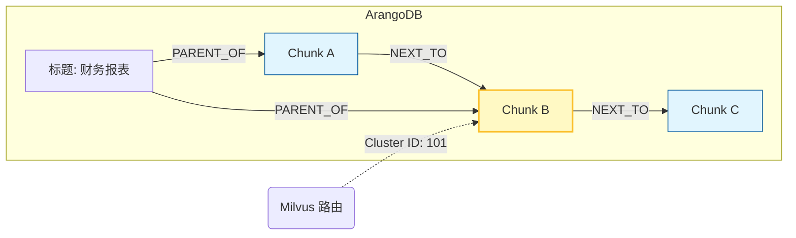

# 基于Milvus和ArangoDB的RAG系统

> ipynb可执行代码请点击：[基于Milvus和ArangoDB的RAG系统.ipynb](https://github.com/datawhalechina/easy-vectordb/blob/main/docs/projects/project3/project3.ipynb)

很多学习者没有了解过ArangoDB这个数据库，下面，你可以通过该部分系统性的了解这个数据库，也可以跳过这部分直接看设计思想部分。

## 1. 什么是 ArangoDB？(Core Concept)

在传统架构中，我们通常需要一个 **MongoDB** 存文档，再用一个 **Neo4j** 存图关系。
**ArangoDB** 的核心理念是 **Multi-Model（多模态）**：
> **“One Engine, One Query Language, Multiple Data Models”**

它在一个数据库引擎中同时支持：
1.  **文档 (Documents)**：像 MongoDB 一样存储 JSON 数据（我们的 Chunks 正文）。
2.  **图 (Graphs)**：像 Neo4j 一样存储节点关系（我们的 Context 上下文）。
3.  **键值 (Key-Value)**：像 Redis 一样快速读写（我们的 Cache）。

### 为什么本项目的 RAG 系统选择 ArangoDB？
*   **存算分离**：Milvus 这种昂贵的显存资源只存“索引向量”，而海量的“文本肉身”需要一个支持倒排索引的数据库来存，ArangoDB 的文档存储非常适合。
*   **上下文召回**：当 RAG 检索到一段话时，我们需要毫秒级找回它的**“上一段话”**或**“父标题”**。传统数据库做关联查询（Join）很慢，而 ArangoDB 的**原生图遍历 (Graph Traversal)** 极快。
*   **统一查询 (AQL)**：我们可以用类似 SQL 的语法（AQL）同时完成“过滤 Cluster ID”和“查找图邻居”两个操作。

---

## 2. 核心术语 (Key Terminology)

在代码中你会频繁遇到以下三个概念，请务必分清：

| 术语 | 对应关系型数据库 | 我们的项目用途 | 示例 |
| :--- | :--- | :--- | :--- |
| **Collection** | 表 (Table) | 存放数据的容器 | `rag_chunks` |
| **Document** | 行 (Row) | 实际的数据记录 (JSON) | `{ "text": "...", "cluster_id": 101 }` |
| **Edge** | 关联表 (Join Table) | **连接线**，特殊的 Document，必须包含 `_from` 和 `_to` | `{ "_from": "Chunk/A", "_to": "Chunk/B", "type": "NEXT_TO" }` |
| **Graph** | 视图 (View) | 定义哪些 Collection 和 Edge 组成一张网 | `rag_knowledge_graph` |

---

## 3. 基础使用方法

本项目使用 `python-arango` 驱动。以下是你在项目中必须掌握的 **CRUD** 和 **图操作** 模板。

### 3.1 连接与初始化

```python
from arango import ArangoClient

# 1. 建立连接
client = ArangoClient(hosts='http://127.0.0.1:8529')

# 2. 连接/创建数据库
sys_db = client.db('_system', username='root', password='pass123')
if not sys_db.has_database('rag_db'):
    sys_db.create_database('rag_db')

db = client.db('rag_db', username='root', password='pass123')
```

### 3.2 存储文档 

这是我们存储 Chunk 正文的地方。

```python
# 创建集合 (类似建表)
if not db.has_collection('rag_chunks'):
    chunks = db.create_collection('rag_chunks')
else:
    chunks = db.collection('rag_chunks')

# 插入数据
doc = {
    "_key": "uuid_1",  # 指定主键，方便查找
    "text": "这是第一段话。",
    "cluster_id": 101
}
chunks.insert(doc, overwrite=True) # overwrite=True 类似 Upsert

# 查询数据 (通过 Key)
result = chunks.get("uuid_1")
print(result['text'])
```

### 3.3 创建关系 (Edge Operation)

这是我们构建“上下文链条”的关键。

```python
# 创建边集合 (必须指定 edge=True)
if not db.has_collection('rag_relations'):
    edges = db.create_collection('rag_relations', edge=True)

# 插入一条边：表示 uuid_1 的下一段是 uuid_2
edge_data = {
    "_from": "rag_chunks/uuid_1",  # 必须带集合前缀
    "_to":   "rag_chunks/uuid_2",
    "type":  "NEXT_TO"
}
edges.insert(edge_data)
```

### 3.4 高级查询：AQL (ArangoDB Query Language)

这是 ArangoDB 最强大的地方。AQL 看起来很像 SQL。

**场景 1：普通查询**
*“给我找出属于聚类 101 的所有文档。”*

```python
aql = """
FOR doc IN rag_chunks
    FILTER doc.cluster_id == 101
    RETURN { id: doc._key, content: doc.text }
"""
cursor = db.aql.execute(aql)
for item in cursor:
    print(item)
```

**场景 2：图遍历（上下文扩展）**
*“找到 uuid_1 这段话，并且顺着 'NEXT_TO' 关系，把它后面的一段话也找出来。”*

```python
graph_aql = """
FOR v, e, p IN 1..1 OUTBOUND 'rag_chunks/uuid_1' rag_relations
    FILTER e.type == 'NEXT_TO'
    RETURN v.text
"""
# 1..1 OUTBOUND: 向外走 1 步
# v: vertex (节点/下一段话)
# e: edge (边)
# p: path (路径)

cursor = db.aql.execute(graph_aql)
next_text = [doc for doc in cursor]
print(f"下文是: {next_text}")
```

---

## 4. 在本项目中的数据流转图

为了让你彻底理解，请看这张数据在 ArangoDB 内部的流转图：



1.  **Milvus** 告诉我们要找 **Chunk B**（黄色高亮）。
2.  我们直接去 ArangoDB 拿到 **Chunk B** 的正文。
3.  通过 **AQL 图遍历**，我们瞬间抓取到：
    *   `OUTBOUND` -> **Chunk C** (下文)
    *   `INBOUND` -> **Chunk A** (上文)
    *   `INBOUND` -> **Header** (父标题)

## 设计思想
传统的RAG（切片+向量库）存在两个致命问题：
1. 断章取义：把文档切割为500字一段，丢失了”这段话属于哪个标题“的上下文。
2. 显存昂贵：几百万条向量全部塞入Milvus，内存占用巨大，且包含大量无关噪音。

我们这里提出了一种新的设计方案：FusionGraph RAG：基于聚类路由与图谱增强的检索系统

我们的解决方案：
1. Meta-chunking：利用OCR版面分析，按照标题和语义切分，而不是按字数。(本教程为了学习者更好的跑通流程，并未使用OCR)
2. FusionANNS：
    * Milvus变身为路由表，只存储聚类中心，极度节省内存
    * ArangoDB变为藏书阁，存储原始文本和图关系。
3. Graph Expansion（图谱扩展）：检索到一句话时，顺着图关系把他们的父标题和前一段一起捞出来，给LLM看完整的上下文。


| 阶段 (Stage) | 输入 (Input) | 核心动作 (Action) | 输出 (Output) | 承载组件 |
| :--- | :--- | :--- | :--- | :--- |
| **1. ETL 数据处理层** | 原始 PDF | **OCR 版面分析** + **Meta-Chunking** (语义切分) | 结构化的 Chunks (含 Header 路径) | PaddleOCR, Python |
| **2. 索引构建层** | Chunks | **BGE-M3 向量化** + **FAISS 聚类** | 质心向量 (Centroids) + 聚类 ID | FAISS (GPU), BGE-M3 |
| **3. 存储与服务层** | 质心 & Chunks | **双写分发 (Dual Ingestion)** | Milvus (路由) + ArangoDB (内容) | Milvus, ArangoDB |

## 详细表结构设计
严格遵循存算分离原则：Milvus只存储索引头，ArangoDB存储全量数据

### 1.Milvus表结构设计
**设计原则**
极度瘦身，只存储话题簇的中心点，用于快速定位用户问题属于哪个领域（例如：财务、技术、运动）

Collection Name：rag_cluster_centorids
| 字段名 | 数据类型 | 属性 | 解释与设计理由 |
| :--- | :--- | :--- | :--- |
| **`cluster_id`** | **Int64** | **Primary Key** | **核心连接点**。这是连接 Milvus 和 ArangoDB 的唯一钥匙。例如：`101`。 |
| **`vector`** | **FloatVector** | Dim=1024 | **质心向量**。该聚类下所有 Chunk 向量的平均值。查询时用它做相似度匹配。 |
| `member_count` | Int32 | Scalar | 该聚类包含多少个 Chunk。用于后续可能的权重调整（比如大聚类降权）。 |
* 为什么要这么设计？
    * 省钱：假设有1000万个chunk，聚成一万个类，Milvus只存储1万条向量，内存占用直接变为原来的一千分之一
    * 快：在一万条数据里搜索Top-5，比在1000万条里搜，速度快几个数量级

### 2.ArangoDB表结构设计
**设计原则**存储全量数据，并利用图关系解决上下文丢失问题

#### A. 节点集合 (Document Collection): `rag_chunks`

| 字段名 | 类型 | 索引类型 | 解释与设计理由 |
| :--- | :--- | :--- | :--- |
| **`_key`** | String | Primary | **Chunk UUID**。唯一标识一个文本块。 |
| **`cluster_id`** | Int64 | **Persistent Index** | **外键**。对应 Milvus 里的 ID。**查询时通过此字段毫秒级拉取该簇所有数据。** |
| `text` | String | None | **正文**。最占空间的数据，存在磁盘上，不占宝贵的显存。 |
| `header_path`| List[Str]| None | **层级路径**。例如 `['2023年报', '财务数据']`。用于生成引用来源。 |
| `metadata` | JSON | None | 存 Page, BBox 等元数据，用于前端高亮显示。 |

#### B. 边集合 (Edge Collection): `rag_relations`

| 字段名 | 类型 | 解释与设计理由 |
| :--- | :--- | :--- |
| **`_from`** | String | 起始节点 ID (例如 `rag_chunks/uuid_A`) |
| **`_to`** | String | 目标节点 ID (例如 `rag_chunks/uuid_B`) |
| **`type`** | String | **关系类型**。核心设计点，用于上下文扩展。 |

*   **关系类型 (`type`) 详解**：
    *   `NEXT_TO`: 表示阅读顺序。查询到 Chunk A 时，顺着这条边能找到 Chunk B（下一段）。
    *   `PARENT_OF`: 表示层级。查询到 Chunk A 时，反向遍历这条边能找到它的父标题节点（如果有独立标题节点设计）。

*   **为什么要这么设计？**
    *   **上下文救星**：当 LLM 看到一句“净利润增长 10%”时，它不知道是谁的。通过图遍历 `PARENT_OF` 找到父标题“华东分公司”，LLM 就能精准回答。
    *   **灵活**：Milvus 这种向量库很难存这种网状关系，图数据库是最佳选择。

## 数据格式

### 分段后的数据格式
```json
{
  "id": "a1b2c3d4-5678-90ef-...",  // UUID v4 或 MD5
  "text": "2023年公司净利润为2.5亿元，同比增长15%...",
  "metadata": {
    "source_file": "2023_financial_report.pdf",
    "page_number": 5,
    "chunk_index": 42,             // 在全文中的序号，用于排序
    "bbox": [100, 200, 500, 600],  // PaddleOCR 提供的坐标 [x1, y1, x2, y2]
    "type": "text"                 // text / table
  },
  "header_path": ["2023年度报告", "第四章 财务数据", "主要会计数据"], // 核心：层级路径
  
  // 预留字段，稍后计算填充
  "vector": null,                  // 等待 BGE-M3 填充
  "sparse_vector": null,           // 等待 BGE-M3 填充
  "cluster_id": -1,                // 等待 FAISS 填充
  "prev_chunk_id": "e5f6...",      // 指向第 41 号 Chunk 的 ID
  "next_chunk_id": "g7h8..."       // 指向第 43 号 Chunk 的 ID
}
```
### ArangoDB数据格式
#### 节点表-存正文
```json
// Document Example
{
  "_key": "a1b2c3d4...",           // 直接复用 Chunk 的 UUID
  "text": "2023年公司净利润...",
  "source": "2023_financial_report.pdf",
  "page": 5,
  "cluster_id": 105,               // 关键索引字段：用于从 Milvus 路由过来
  "header_path_str": "2023年度报告 > 财务数据", // 方便人类阅读的字符串
  "embedding_status": true
}
```
#### 节点表-存标题
```json
// Document Example
{
  "_key": "md5_of_header_text",    // 标题内容的 Hash
  "text": "主要会计数据",
  "level": 3                       // H3 标题
}
```
#### 边表-存关系
```json
{
  "_from": "rag_chunks/chunk_42",
  "_to": "rag_chunks/chunk_43",
  "type": "NEXT_TO"
}
```
## 数据处理

[document.pdf](https://github.com/Anduin2017/HowToCook)是一个做饭的文档，里面有800多页，现在我们对其进行处理，保存为我们需要的数据格式，有条件的可以用OCR，但这里我用的PyMuPDF+Ray，尽可能把CPU跑满，效率最大化,PyMuPDF是Python界最快的PDF解析库，底层基于C++实现，可以直接提取文本的字体大小和位置 。

这里我们要对之前的策略进行调整：以前我们靠OCR告诉我们哪里是标题，现在我们需要靠字体大小猜测标题位置（比如：字号 > 正文平均字号的 1.2 倍 -> 视为 H1/H2）。

```shell
pip install ray pymupdf langchain langchain-community zhipuai faiss-cpu numpy tqdm
```
1.  **Ray + PyMuPDF**: 并行提取 800 页 PDF 的纯文本。
2.  **LangChain Splitter**: 使用标准的 `RecursiveCharacterTextSplitter` 进行切片。
3.  **ZhipuAI API**: 调用云端模型生成向量。
4.  **FAISS (CPU)**: 本地快速聚类。


1.  **Ray 负责脏活累活**：
    *   PDF 解析是 CPU 密集型任务，Ray 利用多核并行处理，速度极快。
    *   只提取纯文本，内存占用极低。

2.  **LangChain 负责规范化**：
    *   使用了 `RecursiveCharacterTextSplitter`。这是目前最通用的分段方式，虽然它不如 Meta-Chunking 智能（会丢失 Header 层级信息），但**兼容性最好，上手最快**。
    *   它会自动处理标点符号切分，保证句子尽量完整。

3.  **智谱 API 负责核心算力**：
    *   使用了 `ZhipuAIEmbeddings`。你只需要填 Key，剩下的交给云端。
    *   **注意**：800 页 PDF 可能会生成 5000-8000 个 Chunk。智谱 API 是收费的（虽然 embedding-2 很便宜），请关注你的 Token 用量。

4.  **数据结构保持兼容**：
    *   虽然因为使用了 LangChain Splitter，我们丢失了 `header_path` 的自动提取（现在为空列表 `[]`），但 `cluster_id` 和图谱所需的 `prev/next` 链表关系依然保留。这不影响我们后续构建“存算分离”架构，只是图谱里少了一种“父子关系”边而已。

```python
import ray
import fitz  # PyMuPDF
import os
import json
import uuid
import numpy as np
import faiss
from typing import List, Dict
from tqdm import tqdm

# LangChain 组件
from langchain.text_splitter import RecursiveCharacterTextSplitter
from langchain_community.embeddings import ZhipuAIEmbeddings

# ==================================================
# 配置区域
# ==================================================
ZHIPU_API_KEY = ""  # 你的智谱APIKey
PDF_PATH = "document.pdf"   # 你的PDF路径

# ==================================================
# 1. Ray Actor: PDF 文本提取工兵
# ==================================================
@ray.remote
class PDFTextExtractor:
    def __init__(self):
        pass

    def extract_text(self, pdf_path, start_page, end_page):
        """
        只负责提取文本，不负责分段。
        返回: List[Dict] -> [{'page': 1, 'text': '...'}, ...]
        """
        doc = fitz.open(pdf_path)
        results = []
        
        # 防止页码越界
        total = len(doc)
        
        for p_num in range(start_page, end_page):
            if p_num >= total: break
            
            page = doc[p_num]
            text = page.get_text("text") # 直接提取纯文本
            
            # 简单的清洗，去掉过多的空行
            clean_text = "\n".join([line.strip() for line in text.split('\n') if line.strip()])
            
            if clean_text:
                results.append({
                    "page": p_num + 1,
                    "text": clean_text
                })
                
        doc.close()
        return results

# ==================================================
# 2. LangChain 分段逻辑
# ==================================================
def split_text_with_langchain(raw_pages: List[Dict]):
    print("--- 正在使用 LangChain RecursiveCharacterTextSplitter 分段 ---")
    
    # 初始化 LangChain 分割器
    # chunk_size: 每个块的字符数
    # chunk_overlap: 重叠部分，防止上下文丢失
    text_splitter = RecursiveCharacterTextSplitter(
        chunk_size=500,
        chunk_overlap=50,
        separators=["\n\n", "\n", "。", "！", "？", " ", ""]
    )
    
    final_chunks = []
    
    # 遍历每一页进行切分
    # 注意：LangChain 通常处理纯文本，我们需要把 page metadata 带进去
    for page_data in raw_pages:
        page_num = page_data['page']
        content = page_data['text']
        
        # 调用 LangChain 切分
        # create_documents 会返回 Document 对象列表
        docs = text_splitter.create_documents([content])
        
        for i, doc in enumerate(docs):
            chunk_dict = {
                "id": str(uuid.uuid4()),
                "text": doc.page_content,
                "header_path": [], # 纯文本提取丢失了 Header 信息，这里留空或后续补
                "metadata": {
                    "source": "doc.pdf",
                    "page": page_num,
                    "chunk_index_in_page": i,
                    "type": "text"
                },
                # 预留字段
                "vector": None,
                "cluster_id": -1,
                "prev_chunk_id": None,
                "next_chunk_id": None
            }
            final_chunks.append(chunk_dict)
            
    # 建立链表关系 (Next/Prev)
    for i in range(len(final_chunks)):
        if i > 0:
            final_chunks[i]['prev_chunk_id'] = final_chunks[i-1]['id']
        if i < len(final_chunks) - 1:
            final_chunks[i]['next_chunk_id'] = final_chunks[i+1]['id']
            
    return final_chunks

# ==================================================
# 3. ZhipuAI 向量化 & FAISS 聚类
# ==================================================
def process_embeddings_and_clusters(chunks):
    print("--- 正在调用智谱 API 生成向量 ---")
    
    if "你的API_KEY" in ZHIPU_API_KEY:
        raise ValueError("请先在代码顶部填入正确的 ZHIPU_API_KEY")

    # 初始化 LangChain 的智谱 Embeddings
    embeddings_model = ZhipuAIEmbeddings(
        model="embedding-2", # 智谱目前的通用 Embedding 模型
        api_key=ZHIPU_API_KEY
    )
    
    texts = [c['text'] for c in chunks]
    vectors = []
    
    batch_size = 10 
    
    for i in tqdm(range(0, len(texts), batch_size), desc="Embedding Progress"):
        batch = texts[i : i + batch_size]
        try:
            batch_vecs = embeddings_model.embed_documents(batch)
            vectors.extend(batch_vecs)
        except Exception as e:
            print(f"Batch {i} failed: {e}")
            vectors.extend([ [0.0]*1024 for _ in range(len(batch)) ])

    # 转换为 numpy 格式
    np_vectors = np.array(vectors).astype('float32')
    
    print("--- 正在进行本地聚类 (FAISS) ---")
    # 聚类数：假设每 30 个 Chunk 是一个话题簇
    num_clusters = max(int(len(chunks) / 30), 2)
    d = np_vectors.shape[1] # 1024
    
    # 训练 K-Means
    kmeans = faiss.Kmeans(d, num_clusters, niter=20, verbose=True)
    kmeans.train(np_vectors)
    
    # 寻找归属
    D, I = kmeans.index.search(np_vectors, 1)
    cluster_ids = I.flatten().tolist()
    centroids = kmeans.centroids
    
    # 回填
    for k, chunk in enumerate(chunks):
        chunk['vector'] = vectors[k]
        chunk['cluster_id'] = int(cluster_ids[k])
        
    return chunks, centroids

# ==================================================
# 4. 主程序
# ==================================================
def main():
    ray.init(ignore_reinit_error=True)
    
    if not os.path.exists(PDF_PATH):
        print(f"找不到文件: {PDF_PATH}")
        return

    doc = fitz.open(PDF_PATH)
    total_pages = len(doc)
    doc.close()
    
    print(f"文档共 {total_pages} 页，启动 Ray 并行解析...")
    
    # 1. Ray 提取文本
    num_actors = 8
    chunk_size = 50 # 每次处理 50 页
    
    actors = [PDFTextExtractor.remote() for _ in range(num_actors)]
    futures = []
    
    for i in range(0, total_pages, chunk_size):
        actor = actors[ (i // chunk_size) % num_actors ]
        futures.append(
            actor.extract_text.remote(PDF_PATH, i, min(i+chunk_size, total_pages))
        )
        
    results_nested = ray.get(futures)
    
    # 展平并按页码排序
    all_pages = []
    for res in results_nested:
        all_pages.extend(res)
    all_pages.sort(key=lambda x: x['page'])
    
    print(f"提取完成，共 {len(all_pages)} 页有效文本")
    
    # 2. LangChain 分段
    final_chunks = split_text_with_langchain(all_pages)
    print(f"LangChain 切分完成，共生成 {len(final_chunks)} 个 Chunks")
    
    # 3. 智谱 Embedding + 聚类
    processed_chunks, centroids = process_embeddings_and_clusters(final_chunks)
    
    # 4. 保存结果
    output_file = "ready_for_db_zhipu.json"
    data = {
        "centroids": centroids.tolist(),
        "chunks": processed_chunks
    }
    
    with open(output_file, 'w', encoding='utf-8') as f:
        json.dump(data, f, ensure_ascii=False, indent=2)
        
    print(f"✅ 全部完成！数据已保存至 {output_file}")

if __name__ == "__main__":
    main()
```
现在我们已经有了核心数据了，接下来的任务就是把这些数据各归其位。

## 双写存库
这一步非常关键，我们将实现：
1. Milvus建表写入：把质心向量存进去，简历HNSW索引
2. ArangoDB建图与写入：把Chunk存为节点，把Next_to关系存为边

默认你已经安装好了Milvus和Attu，请先在docker-desktop启动milvus，
如果你没有安装ArangoDB，请执行：
```shell
docker run -d -p 8529:8529 -e ARANGO_ROOT_PASSWORD=pass123 --name arango swr.cn-north-4.myhuaweicloud.com/ddn-k8s/docker.io/arangodb/arangodb:3.11
```

然后执行以下指令，安装所需依赖

```shell
pip install pymilvus python-arango
```
全部执行成功后，请执行下面的代码，下面的代码保证了幂等性：如果表已存在会先删除再重建，确保调试的时候数据不会重复

```python
import json
import time
from pymilvus import (
    connections, FieldSchema, CollectionSchema, DataType, 
    Collection, utility
)
from arango import ArangoClient

# ==========================================
# 配置区域
# ==========================================
JSON_FILE = "ready_for_db_zhipu.json"

# Milvus 配置
MILVUS_HOST = "127.0.0.1"
MILVUS_PORT = "19530"
MILVUS_COLLECTION = "rag_cluster_centroids"
DIMENSION = 1024 

# ArangoDB 配置
ARANGO_URL = "http://127.0.0.1:8529"
ARANGO_USER = "root"
ARANGO_PASS = "pass123" 
ARANGO_DB_NAME = "rag_db"
ARANGO_GRAPH_NAME = "rag_knowledge_graph" # 图名称

def load_json_data():
    print(f"正在读取 {JSON_FILE} ...")
    try:
        with open(JSON_FILE, 'r', encoding='utf-8') as f:
            data = json.load(f)
        return data
    except FileNotFoundError:
        print(f"错误: 找不到文件 {JSON_FILE}，请检查路径。")
        exit(1)

# ==========================================
# 1. Milvus 入库逻辑 (存路由)
# ==========================================
def ingest_to_milvus(centroids):
    print("\n=== 开始写入 Milvus (路由层) ===")
    
    # 1. 连接
    try:
        connections.connect("default", host=MILVUS_HOST, port=MILVUS_PORT)
    except Exception as e:
        print(f"Milvus 连接失败: {e}")
        return

    # 2. 清理旧表
    if utility.has_collection(MILVUS_COLLECTION):
        utility.drop_collection(MILVUS_COLLECTION)
        print(f"已删除旧表: {MILVUS_COLLECTION}")
        
    # 3. 定义 Schema
    fields = [
        FieldSchema(name="cluster_id", dtype=DataType.INT64, is_primary=True),
        FieldSchema(name="vector", dtype=DataType.FLOAT_VECTOR, dim=DIMENSION)
    ]
    schema = CollectionSchema(fields, description="RAG Cluster Centroids")
    
    # 4. 创建集合
    collection = Collection(name=MILVUS_COLLECTION, schema=schema)
    print("表结构创建成功")
    
    # 5. 插入数据
    ids = [i for i in range(len(centroids))]
    vectors = centroids
    
    if len(vectors) > 0 and len(vectors[0]) != DIMENSION:
        print(f"错误: 向量维度 {len(vectors[0])} 与配置 {DIMENSION} 不符！")
        return

    mr = collection.insert([ids, vectors])
    print(f"插入请求已提交，受影响行数: {mr.insert_count}")
    
    print("正在刷盘 (Flush)...")
    collection.flush()
    
    # 7. 创建索引
    index_params = {
        "metric_type": "COSINE", 
        "index_type": "HNSW",
        "params": {"M": 16, "efConstruction": 200}
    }
    print("正在构建索引...")
    collection.create_index(field_name="vector", index_params=index_params)
    utility.index_building_progress(MILVUS_COLLECTION)
    
    # 8. Load
    collection.load()
    print("Milvus Collection Loaded ✅")

# ==========================================
# 2. ArangoDB 入库逻辑 (存内容图谱)
# ==========================================
def ingest_to_arango(chunks):
    print("\n=== 开始写入 ArangoDB (内容层) ===")
    
    # 1. 连接
    try:
        sys_client = ArangoClient(hosts=ARANGO_URL)
        sys_db = sys_client.db('_system', username=ARANGO_USER, password=ARANGO_PASS)
        
        # 创建数据库
        if not sys_db.has_database(ARANGO_DB_NAME):
            sys_db.create_database(ARANGO_DB_NAME)
        
        db = sys_client.db(ARANGO_DB_NAME, username=ARANGO_USER, password=ARANGO_PASS)
    except Exception as e:
        print(f"ArangoDB 连接失败: {e}")
        return
    
    COL_CHUNKS = "rag_chunks"
    COL_RELATIONS = "rag_relations"
    
    # 2. 清理环境 (删除旧的 Graph 定义和 Collections)
    # 先删 Graph，再删 Collection，否则会报错
    if db.has_graph(ARANGO_GRAPH_NAME):
        db.delete_graph(ARANGO_GRAPH_NAME)
    if db.has_collection(COL_RELATIONS): db.delete_collection(COL_RELATIONS)
    if db.has_collection(COL_CHUNKS): db.delete_collection(COL_CHUNKS)
    
    # 3. 创建 Collection
    chunks_col = db.create_collection(COL_CHUNKS)
    relations_col = db.create_collection(COL_RELATIONS, edge=True)
    
    # 4. 准备数据
    batch_docs = []
    batch_edges = []
    
    print("正在预处理数据...")
    for chunk in chunks:
        # 确保 cluster_id 存在，否则给默认值 -1
        cid = chunk.get("cluster_id", -1)
        if cid is None: cid = -1

        doc = {
            "_key": chunk["id"], 
            "text": chunk["text"],
            "cluster_id": int(cid),
            "page": chunk["metadata"].get("page", -1),
            "source": chunk["metadata"].get("source", "unknown")
        }
        batch_docs.append(doc)
        
        if chunk.get("next_chunk_id"):
            edge = {
                "_from": f"{COL_CHUNKS}/{chunk['id']}",
                "_to": f"{COL_CHUNKS}/{chunk['next_chunk_id']}",
                "type": "NEXT_TO"
            }
            batch_edges.append(edge)

    # 5. 批量写入 
    print(f"正在批量写入 {len(batch_docs)} 个 Chunk...")
    # on_duplicate="replace" 保证重复运行不报错
    res_docs = chunks_col.import_bulk(batch_docs, on_duplicate="replace") 
    if res_docs['errors'] > 0:
        print(f"警告: Chunk 写入出现 {res_docs['errors']} 个错误! 详情: {res_docs['details']}")
    
    print(f"正在批量写入 {len(batch_edges)} 条关系...")
    res_edges = relations_col.import_bulk(batch_edges, on_duplicate="replace")
    if res_edges['errors'] > 0:
        print(f"警告: 关系写入出现 {res_edges['errors']} 个错误! (可能是 next_id 不存在)")

    # 6. 创建 Graph 定义 (方便在 Web UI 查看)
    print("正在创建图谱定义 (Graph Definition)...")
    edge_definitions = [
        {
            "edge_collection": COL_RELATIONS,
            "from_vertex_collections": [COL_CHUNKS],
            "to_vertex_collections": [COL_CHUNKS]
        }
    ]
    db.create_graph(ARANGO_GRAPH_NAME, edge_definitions=edge_definitions)
    
    # 7. 创建索引
    chunks_col.add_persistent_index(fields=["cluster_id"])
    print("ArangoDB 入库 & 图谱构建完成 ✅")

# ==========================================
# 主程序
# ==========================================
if __name__ == "__main__":
    data = load_json_data()
    centroids = data.get("centroids", [])
    chunks = data.get("chunks", [])
    
    if not centroids or not chunks:
        print("错误: JSON 数据为空或格式不正确")
        exit(1)

    print(f"数据加载完毕: {len(centroids)} 个质心, {len(chunks)} 个文本块")
    
    # 执行写入
    ingest_to_milvus(centroids)
    ingest_to_arango(chunks)
```

### 怎么验证成功了？

1.  **ArangoDB**: 浏览器打开 `http://127.0.0.1:8529`，登录 root/pass123。
    *   选择数据库 `rag_db`。

        
        
    *   点左侧 **COLLECTIONS** -> `rag_chunks`。你应该能看到所有的文本块。

        

    *   点 **GRAPHS** -> Create Graph -> 选刚才那两个表 -> 随便点一个节点，看看能不能看到连线（NEXT_TO）。
2.  **Milvus**: 使用 `Attu` (Milvus 的可视化工具) 或者单纯看 Python 脚本最后有没有打印 `Milvus Collection Loaded ✅`。


## 梳理

下面就可以进行搜索了，但在进行搜索之前，我们需要梳理一下，为什么要这么设计，设计的细节你是否理解，存储的时候，milvus和arangodb是如何关联上的，存储的流程是怎么样的，先milvus再arangodb吗，然后存储的时候，这样设计是为了方便搜索吗，解决了什么问题


我们现在停下来，不写代码，专门把 “为什么要这么设计” 和 “它们是怎么关联的” 这两个问题彻底拆解清楚。

**1. 核心疑问：Milvus和ArangoDB是如何关联上的？**
答案：通过cluster_id关联的。


在存储的时候：
* 我们算出这个N个Chunk可以分为k个类（聚类）。
* 我们给其中的某个类分配了一个号码牌比如：cluster_id = 101
* 我们告诉**Milvus**：号码牌101的特征是[0.1,0.9,0.3...]（聚类中心的质心向量）
* 我们告诉**ArangoDB**：这些chunk都是属于101号的，给他们贴上cluster_id:101的标签

在查询的时候：
* 用户问某个类的名称
* Milvus算了一下，说：去101号找
* 你走到了ArangoDB，喊了一声：那些chunk是属于101号的，站出来！

结论：Milvus和ArangoDB通过聚类id相关联，Milvus存ID->向量，ArangoDB存ID->正文

**2. 存储流程：为什么是先算后存？**

可能有种疑惑：先Milvus再ArangoDB吗？

其实更准确的说法是：先内存计算，再双写分发。

流程复盘：
* 在Python内存里：这是最关键的一步，数据还没有进入数据库之前，已经在Python中进行了向量化和聚类
    * 此时，每个chunk对象在内存中已经有了cluster_id这个属性
* 分发：
    * 只要内存里的数据有了cluster_id，那先写入谁并不重要。
    * 为了代码逻辑清晰，通常并行写入，或者先写入Milvus建立目录，然后再写入ArangoDB。

**3. 解决了什么问题？**

既然有Milvus了，为什么不把text直接存在Milvus的payload中，为什么要搞俩数据库？

问题1：显存太贵，HNSW索引太占用内存
* 传统方法：把1000万条Chunk的向量全部建立HNSW索引。
    * 后果：HNSW索引需要把向量加载到内存，1000万条 x 1024维 x 4字节 ≈ 40GB内存。
* 我们的做法：Milvus只存1万个聚类质心
    * 后果：1万条向量 ≈ 40MB内存
    * 优势：内存占用降低1000倍

问题2：语义检索的近视眼问题
* 传统做法：Milvus搜出来一句话：净利润增长了10%
    * 后果：LLM拿到这句话是懵的。谁的净利润？是集团的还是子公司的？是2023年的还是2022年的？
* 我们的做法：ArangoDB存储了NEXT_TO和PARENT_OF关系。
    * 优势：在查询到这句话的同时，顺着图关系，把它的父标题（华东分公司）和前一段（2023年财报摘要）一起抓出来。LLM瞬间看懂了，Milvus做不到这种图遍历查询

问题3：搜索的漏斗效应
* 传统做法：Top-K搜索（比如K= 5）
    * 后果：如果相关内容有20段，你只召回了5段，剩下的15段丢了，这叫低召回率。
* 我们的做法：先找相关的话题簇
    * 优势：比如命中财务簇，我们把这个簇里的50个Chunk全部拿出来
    * 结果：召回范围扩大了（Recall提升），然后再用Rerank模型精挑细选，这是一种广撒网，精捕捞的策略，适合长文档问答。

## 检索

这里我们会用到BGE-Reranker-Base重排序模型
* 大小：模型文件只有1GB
* 效果：是目前开源界性价比最高的重排序模型之一
* 来源：我们这里用modelscope拉取


```shell
pip install modelscope
```

```python
import torch
from transformers import AutoModelForSequenceClassification, AutoTokenizer
from modelscope import snapshot_download
import numpy as np
from pymilvus import connections, Collection
from arango import ArangoClient
from langchain_community.embeddings import ZhipuAIEmbeddings

# ==========================================
# 配置区域
# ==========================================
ZHIPU_API_KEY = ""

# Milvus & ArangoDB (保持不变)
MILVUS_HOST = "127.0.0.1"
MILVUS_PORT = "19530"
MILVUS_COLLECTION = "rag_cluster_centroids"
ARANGO_URL = "http://127.0.0.1:8529"
ARANGO_USER = "root"
ARANGO_PASS = "pass123"
ARANGO_DB_NAME = "rag_db"
COL_CHUNKS = "rag_chunks"

# 搜索参数
TOP_K_CLUSTERS = 3
TOP_K_FINAL = 5

# ==========================================
# 1. 初始化资源 (新增 Reranker 加载)
# ==========================================
class RerankerEngine:
    def __init__(self):
        print("正在下载/加载 BGE-Reranker 模型 (约1GB)...")
        # 从 ModelScope 下载模型到本地缓存
        model_dir = snapshot_download('Xorbits/bge-reranker-base', revision='master')
        
        self.tokenizer = AutoTokenizer.from_pretrained(model_dir)
        self.model = AutoModelForSequenceClassification.from_pretrained(model_dir)
        self.model.eval() # 评估模式
        
        # 如果有N卡就用cuda，没有就cpu
        self.device = 'cpu' 
        self.model.to(self.device)
        print("Reranker 模型加载完成 ✅")

    def compute_score(self, query, candidates):
        """
        计算 (query, text) 对的相关性分数
        """
        pairs = [[query, doc['text'][:512]] for doc in candidates] # 截断一下防止爆显存
        
        with torch.no_grad():
            inputs = self.tokenizer(pairs, padding=True, truncation=True, return_tensors='pt', max_length=512)
            inputs = {k: v.to(self.device) for k, v in inputs.items()}
            
            scores = self.model(**inputs, return_dict=True).logits.view(-1,).float()
            
        return scores.cpu().numpy()

def init_resources():
    # 1. Milvus & Arango 
    connections.connect("default", host=MILVUS_HOST, port=MILVUS_PORT)
    milvus_col = Collection(MILVUS_COLLECTION)
    milvus_col.load()
    
    client = ArangoClient(hosts=ARANGO_URL)
    db = client.db(ARANGO_DB_NAME, username=ARANGO_USER, password=ARANGO_PASS)
    
    # 2. Embedding
    embed_model = ZhipuAIEmbeddings(model="embedding-2", api_key=ZHIPU_API_KEY)
    
    # 3. Reranker
    reranker = RerankerEngine()
    
    return milvus_col, db, embed_model, reranker

# ==========================================
# 2. 融合检索 (带 Rerank)
# ==========================================
def fusion_search(query: str, milvus_col, db, embed_model, reranker):
    print(f"\n🔎 用户提问: 【{query}】")
    
    # --- Step 1 & 2: 粗排 (Routing) ---
    print(">>> 1. Milvus 路由...")
    q_vec = embed_model.embed_query(query)
    
    res = milvus_col.search(
        data=[q_vec], anns_field="vector", 
        param={"metric_type": "COSINE", "params": {"ef": 64}}, 
        limit=TOP_K_CLUSTERS, output_fields=["cluster_id"]
    )
    target_ids = [hit.id for hit in res[0]]
    
    # --- Step 3: 召回 (Retrieval) ---
    print(f">>> 2. ArangoDB 召回 (Cluster IDs: {target_ids})...")
    aql = f"""
    FOR c IN {COL_CHUNKS}
        FILTER c.cluster_id IN @ids
        RETURN {{ id: c._key, text: c.text, cluster_id: c.cluster_id }}
    """
    candidates = list(db.aql.execute(aql, bind_vars={"ids": target_ids}))
    print(f"候选集数量: {len(candidates)}")
    
    if not candidates: return []

    # --- Step 4: 精排 (Rerank) ---
    print(f">>> 3. BGE-Reranker 精排中...")
    scores = reranker.compute_score(query, candidates)
    
    # 把分数写回去
    for i, doc in enumerate(candidates):
        doc['score'] = float(scores[i])
        
    # 按分数降序
    candidates.sort(key=lambda x: x['score'], reverse=True)
    final_results = candidates[:TOP_K_FINAL]

    # --- Step 5: 上下文扩展 ---
    print(f">>> 4. 图谱上下文扩展...")
    top_doc = final_results[0]
    context_aql = """
    FOR v, e, p IN 1..1 OUTBOUND @start_node rag_relations
        FILTER e.type == 'NEXT_TO'
        RETURN v.text
    """
    start_node_id = f"{COL_CHUNKS}/{top_doc['id']}" 
    
    next_texts = list(db.aql.execute(context_aql, bind_vars={"start_node": start_node_id}))
    top_doc['next_text'] = next_texts[0] if next_texts else "(无后文)"

    return final_results

# ==========================================
# 主程序
# ==========================================
if __name__ == "__main__":
    col, db, embed, rerank = init_resources()
    
    while True:
        q = input("\n请输入问题 (q退出): ").strip()
        if q == 'q': break
        if not q: continue
        
        try:
            results = fusion_search(q, col, db, embed, rerank)
            
            print("\n" + "="*60)
            for i, res in enumerate(results):
                print(f"Rank {i+1} | Score: {res['score']:.4f} | Cluster: {res['cluster_id']}")
                print(f"Content: {res['text'][:100]}...") 
                if i == 0:
                    print(f"Context+: {res.get('next_text', '')[:100]}...")
                print("-" * 30)
                
        except Exception as e:
            print(f"Error: {e}")
```

```python 
import os
from zhipuai import ZhipuAI

# ==========================================
# 配置
# ==========================================
ZHIPU_API_KEY = ""

SYSTEM_PROMPT = """
你是一个基于图谱增强的智能助手。你的任务是根据提供的【参考上下文】回答用户的问题。
请注意：
1. 仅根据参考信息回答，不要编造。
2. 如果参考信息里没有答案，请直接说“根据现有文档无法回答”。
3. 回答要条理清晰，如果参考了上下文的扩展内容，请自然地融合在回答中。
"""

# ==========================================
# RAG 生成逻辑
# ==========================================
def generate_answer(client, query, search_results):
    """
    组装 Prompt 并调用 GLM-4 生成回答
    """
    if not search_results:
        return "抱歉，知识库中没有找到相关内容。"

    # 1. 构建上下文 (Context)
    # 我们取 Top-3 的结果，并把 Top-1 的扩展上下文也拼进去
    context_str = ""
    
    for i, res in enumerate(search_results[:3]):
        context_str += f"--- 参考片段 {i+1} ---\n"
        context_str += f"{res['text']}\n"
        
        # 如果是 Top-1 且有扩展内容，加上去
        if i == 0 and res.get('next_text') and res['next_text'] != "(无后文)":
            context_str += f"[后续内容]: {res['next_text']}\n"
    
    # 2. 组装最终 Prompt
    user_prompt = f"""
    用户问题: {query}
    
    【参考上下文】:
    {context_str}
    
    请根据以上信息回答用户问题。
    """
    
    # 3. 调用大模型 (GLM-4)
    print(">>> 5. 正在思考并生成回答 (GLM-4)...")
    response = client.chat.completions.create(
        model="glm-4",  # 或者 glm-4-flash (更便宜)
        messages=[
            {"role": "system", "content": SYSTEM_PROMPT},
            {"role": "user", "content": user_prompt},
        ],
        stream=True, #以此获得打字机效果
    )
    
    # 4. 流式输出
    print("\n" + "="*20 + " AI 回答 " + "="*20)
    full_answer = ""
    for chunk in response:
        content = chunk.choices[0].delta.content
        print(content, end="", flush=True)
        full_answer += content
    print("\n" + "="*50)
    
    return full_answer

# ==========================================
# 主程序
# ==========================================
if __name__ == "__main__":
    # 1. 初始化检索器 (Milvus, Arango, Reranker)
    # 注意：这步比较慢，因为要加载 Reranker 模型，耐心等待
    print("正在启动 RAG 系统，加载模型中...")
    milvus_col, db, embed_model, reranker = init_resources()
    
    # 2. 初始化 LLM 客户端
    llm_client = ZhipuAI(api_key=ZHIPU_API_KEY)
    
    print("\n RAG 系统已就绪！(输入 'q' 退出)")
    
    while True:
        query = input("\n 请输入问题: ").strip()
        if query.lower() == 'q': break
        if not query: continue
        
        try:
            # Step A: 检索 (Retrieval)
            # 复用之前写好的融合检索函数
            results = fusion_search(query, milvus_col, db, embed_model, reranker)
            
            # Step B: 生成 (Generation)
            generate_answer(llm_client, query, results)
            
        except Exception as e:
            print(f" 发生错误: {e}")
```

## 可视化界面

运行gradio程序，出现了问题，请第一时间怀疑gradio的版本和python版本冲突

```shell
pip install gradio==4.44.1
pip install --upgrade gradio gradio_client pydantic fastapi uvicorn
```
```python
import os
import gradio as gr
from zhipuai import ZhipuAI

# 1. 设置环境变量 (防止代理拦截 localhost)
os.environ["NO_PROXY"] = "localhost,127.0.0.1,::1"

# 2. 尝试导入检索模块
try:
    print(">>> 正在加载模型和数据库...")
    milvus_col, db, embed_model, reranker = init_resources()
    print(" 资源加载成功")
except ImportError:
    milvus_col = db = embed_model = reranker = None
except Exception as e:
    print(f" 资源加载出错: {e}")
    milvus_col = db = embed_model = reranker = None

# 3. 配置 API
ZHIPU_API_KEY = ""
llm_client = ZhipuAI(api_key=ZHIPU_API_KEY)

# 4. 核心逻辑函数 
def chat_function(message, history):
    """
    history 现在的格式是: 
    [{'role': 'user', 'content': 'hi'}, {'role': 'assistant', 'content': 'hello'}]
    """
    if not message:
        yield history, ""
        return
    
    # 追加用户消息 (字典格式)
    history.append({"role": "user", "content": message})
    yield history, "正在思考..."
    
    log_content = f"🔎 用户提问: {message}\n" + "-"*30 + "\n"
    
    try:
        # A. 检索
        results = []
        if milvus_col:
            log_content += ">>> Fusion Search...\n"
            results = fusion_search(message, milvus_col, db, embed_model, reranker)
            
        if not results:
            log_content += "⚠️ 未召回相关内容。\n"
            context_str = ""
        else:
            # 记录 Top-1
            top1 = results[0]
            log_content += f"✅ Top-1 Score: {top1.get('score', 0):.4f} | Cluster: {top1['cluster_id']}\n"
            log_content += f"📄 片段: {top1['text'][:50]}...\n"
            if top1.get('next_text'):
                log_content += f"🔗 扩展: {top1['next_text'][:30]}...\n"
            
            # 构建 Context
            context_str = ""
            for i, res in enumerate(results[:3]):
                context_str += f"参考 {i+1}: {res['text']}\n"
                if i == 0 and res.get('next_text'):
                    context_str += f"[下文]: {res['next_text']}\n"

        # B. 生成
        if context_str:
            user_prompt = f"用户问题: {message}\n\n【参考资料】:\n{context_str}\n\n请根据资料回答。"
        else:
            user_prompt = message # 没查到就直接问

        log_content += ">>> GLM-4 Generating...\n"
        
        # 追加一个空的 AI 消息占位符
        history.append({"role": "assistant", "content": ""})
        yield history, log_content
        
        response = llm_client.chat.completions.create(
            model="glm-4",
            messages=[
                {"role": "system", "content": "你是一个RAG助手。"},
                {"role": "user", "content": user_prompt},
            ],
            stream=True,
        )
        
        partial_answer = ""
        for chunk in response:
            if chunk.choices[0].delta.content:
                partial_answer += chunk.choices[0].delta.content
                # 更新最后一条消息的内容
                history[-1]["content"] = partial_answer
                yield history, log_content

    except Exception as e:
        error_msg = f"❌ Error: {str(e)}"
        # 出错也更新进界面
        if history[-1]["role"] == "assistant":
            history[-1]["content"] = error_msg
        else:
            history.append({"role": "assistant", "content": error_msg})
        yield history, log_content + "\n" + error_msg

# 5. 构建界面对象
with gr.Blocks(title="FusionGraph RAG", theme=gr.themes.Soft()) as demo:
    gr.Markdown("## 🧠 FusionGraph RAG")
    
    with gr.Row():
        with gr.Column(scale=2):
            chatbot = gr.Chatbot(height=600, label="对话")
            msg = gr.Textbox(label="问题", placeholder="请输入...")
            clear = gr.Button("清空")

        with gr.Column(scale=1):
            log_box = gr.TextArea(label="思维链日志", lines=25, interactive=False)

    # 绑定事件
    msg.submit(chat_function, [msg, chatbot], [chatbot, log_box])
    # 清空时返回空列表
    clear.click(lambda: [], None, chatbot, queue=False)

# 6. 启动
if __name__ == "__main__":
    print("启动中...")
    demo.queue().launch(
        server_name="127.0.0.1", 
        server_port=9200, 
        share=False,
        inbrowser=True
    )
```