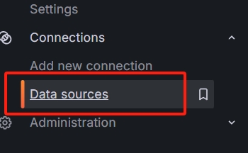
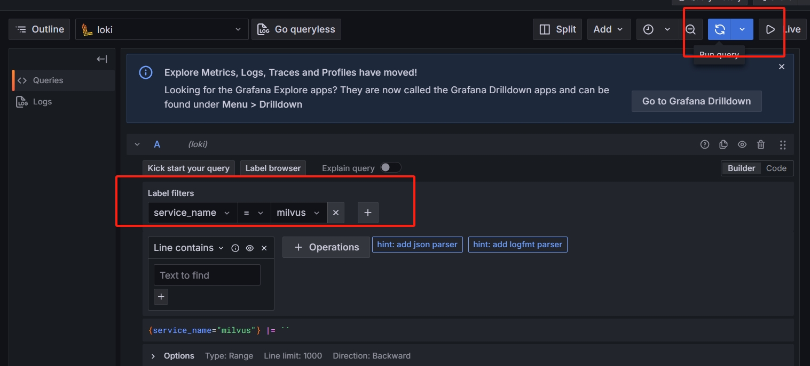
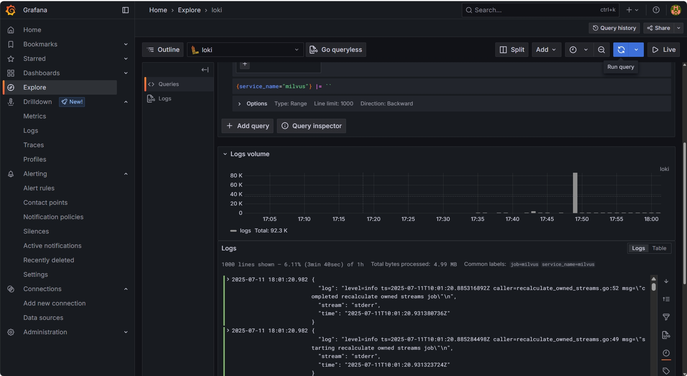

## Loki + Promtail + Grafana 日志系统本地部署指南（适配 Docker Desktop K8s）

本指南适用于在 Windows/Mac 上通过 Docker Desktop 启用的本地 Kubernetes 集群，快速部署 Loki 日志系统、Promtail 日志采集与 Grafana 可视化。

### 1. 创建监控命名空间
```bash
kubectl create namespace monitoring
```

### 2. 部署 Loki
依次执行以下命令：
```bash
kubectl apply -f yml/loki-config.yaml -n monitoring
kubectl apply -f yml/loki-deployment.yaml -n monitoring
kubectl apply -f yml/loki-service.yaml -n monitoring
```
Loki 会以 root 用户运行，存储采用 emptyDir 临时目录，适合本地开发环境。

### 3. 部署 Promtail
```bash
kubectl apply -f yml/promtail-config.yaml -n monitoring
kubectl apply -f yml/promtail-daemonset.yaml -n monitoring
```
Promtail 会自动采集本地容器日志（如 Milvus），并推送到 Loki。

### 4. 部署 Grafana
```bash
kubectl apply -f yml/grafana-config.yaml -n monitoring
kubectl apply -f yml/grafana-pvc.yaml -n monitoring
kubectl apply -f yml/grafana-deployment.yaml -n monitoring
kubectl apply -f yml/grafana-service.yaml -n monitoring
```
Grafana 会通过 NodePort 方式暴露 30001 端口。

### 5. 验证服务状态
查看 Pod 和服务是否正常运行：
```bash
kubectl get pods -n monitoring
kubectl get svc -n monitoring
```
所有 Pod 状态应为 Running，服务应有对应端口。

### 6. 访问 Grafana
在本地浏览器直接访问：
```
http://localhost:30001
```
默认用户名密码：`admin` / `admin`


### 7. 添加 Loki 数据源
1. 登录 Grafana 后，在左侧框中选中Connection
    

2. 选择 Connection下的Data sources，选择 Add data source，搜索并选择 Loki。
   
   
   
3. 回到Connections
4. URL 填写：`http://loki:3100`
   
5. 点击 Save & Test 测试连接。
   
6. 测试成功后回到loki中，点击explore
   

### 8. 日志查询示例
在 Grafana 左侧选择 Explore，
选择Loki，输入查询语句
   
1. 运行查询
   
2. 测试结果
   
即可实时查看 Milvus 相关日志。


### 9. 常见问题与排查

#### 9.1 Pod 卡在 ContainerCreating 状态
排查命令：
```bash
kubectl describe pod <pod-name> -n monitoring
kubectl logs <pod-name> -n monitoring
```
常见原因：
- 镜像拉取失败：检查网络和镜像名
- 挂载卷失败：检查 PVC/PV 配置
- 资源不足：检查本地资源分配（Docker Desktop 设置 CPU/内存）

#### 9.2 Grafana/Loki 无法访问
- 检查端口是否被占用，或 NodePort 是否正确暴露
- 检查 Pod 状态，必要时重启 Pod：
  ```bash
  kubectl delete pod <pod-name> -n monitoring
  ```

#### 9.3 Loki 权限或存储问题
- Loki 已以 root 用户运行（见 loki-deployment.yaml）
- 如遇目录权限报错，可尝试：
  ```bash
  sudo chmod -R 777 /var/lib/loki/wal
  ```
- 本地开发建议使用 emptyDir 临时存储，避免持久化存储权限问题

#### 9.4 日志采集不到
- 检查 promtail 配置，确认采集路径与容器日志路径一致
- 查看 promtail 日志：
  ```bash
  kubectl logs -l app=promtail -n monitoring
  ```
- 查看 Loki 日志：
  ```bash
  kubectl logs -l app=loki -n monitoring
  ```

---
如需采集自定义容器日志，请修改 promtail-config.yaml 中的采集路径。
如需持久化存储，请为 Loki/Grafana 配置 PVC，并调整 yaml 文件。
